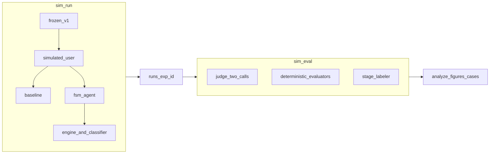

# fsm-llm-eval

Simulation and evaluation harness comparing two LLM customer-service agents.

- **baseline:** one well-written system prompt plus the full knowledge base.
- **fsm:** the instruction package of the current FSM state, plus the same full
  knowledge base, plus the user-event classifier that drives the engine.

The experiment compares **instruction structure as a package**, not a subset of
facts. Both agents call the same local model through Ollama, against the same
simulated user and the same frozen scenarios. Evaluation is a blind LLM judge
(two calls per dialogue) plus deterministic evaluators, followed later by a blinded
human census of the scored dialogues. The **scenario** is the inferential unit:
statistics pair the two agents by scenario, not by dialogue.

**Start here:** [`docs/README.md`](docs/README.md) tells the experiment as one story —
question, design, pilots, execution, results and limitations — with diagrams, and
links every other doc in reading order.

MBA thesis (TCC, written in Portuguese). The experiment, this repository, and
everything the models read or write are in English. Work plan and dated
decisions live in `~/Documents/mba/projeto/` (`TICKETS.md`, `DECISOES.md`,
`PROGRESSO.md`), outside this repository.

Release: package `1.2.0`, annotated tag `v1.2`. Historical tags `v1` and `v1.1`
are T-16 milestones and stay untouched.

## Architecture



## Requirements

- macOS on Apple Silicon. The `run` phase needs the agent and the simulated user
  resident together; 16 GB does not manage that. Machine measurements:
  [`docs/setup.md`](docs/setup.md).
- [uv](https://docs.astral.sh/uv/) (`brew install uv`).
- [just](https://just.systems) (`brew install just`).
- Python 3.13 (`.python-version`); uv installs it if missing.
- [Ollama](https://ollama.com) with the models and **digests** in
  `configs/models.yaml`. Same version and same digests on every machine that
  runs dialogues or the judge.

## Installation

```bash
git clone git@github.com:hugoantunes/fsm-llm-eval.git ~/projects/fsm-llm-eval
cd ~/projects/fsm-llm-eval
just install
scripts/ollama_env.sh
just pull-models
just verify-models
```

Keep the clone **outside iCloud**. Code travels through GitHub; `runs/` travels
by `rsync` over SSH.

`scripts/ollama_env.sh` applies `OLLAMA_MAX_LOADED_MODELS`, `OLLAMA_KEEP_ALIVE`,
`OLLAMA_NUM_PARALLEL` and `OLLAMA_CONTEXT_LENGTH` through `launchctl setenv`.
`export` in a shell has no effect on the macOS app. **It does not survive a
reboot;** run it again after each restart, before `run` or `eval`. Details:
[`docs/setup.md`](docs/setup.md).

## Run the T-15 pilot

Five frozen-v1 scenarios × both agents × 2 repetitions. Omit `--agent` so both
`baseline` and `fsm` run. Use a **new** exp id so this does not overwrite
historical pilot directories.

```bash
just run readme_pilot data/scenarios/v1 2 2 \
  --scenario-id happy_path_06 \
  --scenario-id edge_02 \
  --scenario-id edge_19 \
  --scenario-id adversarial_04 \
  --scenario-id adversarial_13
just adherence runs/readme_pilot
just eval runs/readme_pilot
```

Scenarios: at least one per category, including a needle (`happy_path_06`), an
out-of-scope ending (`adversarial_04`) and the canary injection (`adversarial_13`),
plus `edge_02` and `edge_19`. These are the five scenarios of every pilot round (first
pilot, Pilot v1, Pilot v2; see [`docs/pilot.md`](docs/pilot.md)). `just adherence` is
the gate before eval.

## Full experiment

The T-17 experiment is **already executed**. `runs/exp_final/` is frozen
historical evidence. **Do not replay** `runs/exp_final/`.

The original plan split machines: `run` on the MacBook Air M4 24 GB, `eval` on
the MacBook Pro M5 16 GB. The documented fallback is what actually ran: **both
`run` and evaluation on the Air**. The Pro only pulls `runs/` as backup.

Protocol and provenance: [`docs/execution.md`](docs/execution.md). Hardware:
[`docs/setup.md`](docs/setup.md). What came out of it:
[`docs/README.md`](docs/README.md#8-results).

## Regenerate analysis

Audited scored CSVs under `results/exp_final/` are the source. These recipes
regenerate derived analysis and report artifacts. They **do not rerun** the
experiment and they make no new judge calls. `just analyze` and `just figures`
need pandas, scipy and matplotlib, which `just install` now installs.

```bash
just analyze
just figures
just figures results/human_primary
just cases
just appendices
```

`results/exp_final/metrics.csv` is the semantic-primary exported scored data.
`results/exp_final/metrics_frozen_gate.csv` is a sensitivity artifact in the
repository; it is not part of the delivery folder.

`just figures results/human_primary` writes the human-census plates from
`results/human_primary/`: tables 1–5 and figures 1–5, where plates 1–3 mirror the
judge plates and 4–5 compare human and judge (figure 5 is the paired-difference
forest). It does not edit `frozen/` human sheets.

## Delivery

A distribution copy, not another source of truth. Default destination:
`~/Documents/mba/entregas/simulacao_v1`.

```bash
just deliver
just deliver --replace
```

`--replace` is destructive replace-total: it deletes the destination tree and
writes a fresh snapshot. It does not merge. Run the real export only after the
`v1.2` annotated tag so `SOURCES.txt` records that commit.

The folder holds the frozen v1 dataset, semantic-primary `metrics.csv`, tables,
figures, the `exp_final` manifest, and `SOURCES.txt`. It does not copy
dialogues, caches, `llm_calls.jsonl`, or adjudication. A full `runs/` backup is
separate: copy it independently if you need original dialogue and cache
provenance.

## Optional smoke (not the T-15 pilot)

`just run` defaults to the three examples under `data/scenarios/examples`, 1
repetition, `--parallel 2`. That is a short loop check, not the canonical
pilot.

```bash
just run exp
```

## Development

```bash
just                    # list the recipes
just test               # pytest, without the integration tests
just test-all           # includes the tests marked `integration` (they need Ollama)
just lint               # ruff check + ruff format --check
just format             # ruff format + ruff check --fix
just check              # lint + test: the gate the hooks run
just generate-scenarios # expand plan.yaml into the next unused vN (never overwrite frozen v1)
just fsm-diagram        # Mermaid diagram of data/fsm/machine.yaml, for docs/fsm.md
just stats <run>        # per-caller tokens and latency
just adherence [run]    # fail unless every dialogue delivered its script beats
just eval <run>         # frozen-gate eval (status=ok only)
just eval-semantic <run>  # sidecar: ok logs plus run-local frozen inclusion IDs
just export-metrics [run] [sidecar]  # T-18: census and byte-copy scored CSVs into results/<exp_id>/
just analyze            # T-19: descriptive.csv, tests.csv, environment.txt
just figures            # T-20: thesis tables and figures
just figures results/human_primary  # human census plates + human vs judge
just cases              # T-21: category_directions.csv and case_candidates.csv
just appendices         # T-22: paste-ready appendices A–D
just decompose          # post hoc: split the frozen fact_f1 effect
just deliver            # T-24: copy the delivery snapshot
just install-analysis   # pandas, scipy, matplotlib, jupyter
```

Code conventions in [ai-assistance/DEVELOPMENT.md](ai-assistance/DEVELOPMENT.md);
project context in [ai-assistance/PREAMBLE.md](ai-assistance/PREAMBLE.md).

## Layout

| Path | What it is |
|---|---|
| `src/sim/` | Python package (`python -m sim`) |
| `tests/` | pytest; anything that talks to Ollama is marked `integration` |
| `data/kb/` | knowledge base: numbered facts, needles, unanswerable questions |
| `data/fsm/` | `machine.yaml` and `states/*.md` |
| `data/prompts/` | versioned prompts |
| `data/scenarios/` | `examples/`, `plan.yaml`, frozen `v1/` (do not edit `v1/`) |
| `configs/` | `models.yaml`: models, digests, `num_ctx`, fixed parameters |
| `runs/` | output of `sim run` / `sim eval`. Contents git-ignored |
| `results/` | exported analysis; `results/exp_final/` is the T-17 scored copy; `results/human_primary/` is the later human census |
| `notebooks/` | `analysis.ipynb` regenerates tables and figures from frozen T-19 CSVs |
| `docs/` | [`docs/README.md`](docs/README.md) (the guide, read first), then the design, pilot, execution and analysis docs it links; `appendices/` A–D (generated) |
| `ai-assistance/` | instructions for AI assistants and hook scripts |

## License

MIT. Hugo Seixas Antunes.
