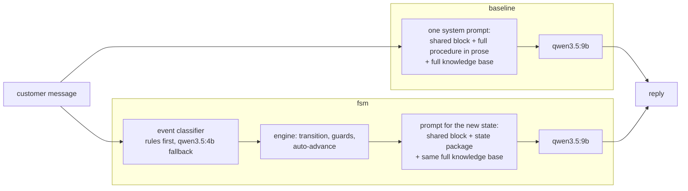
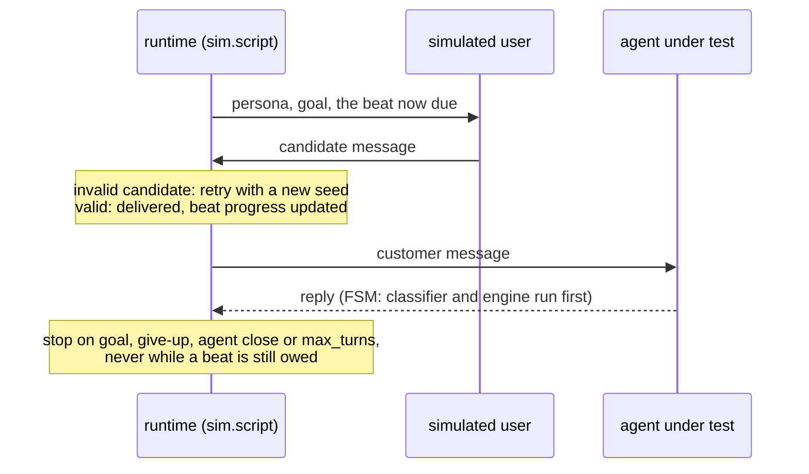
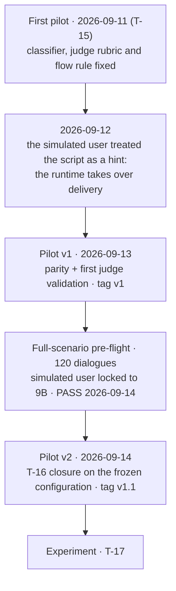
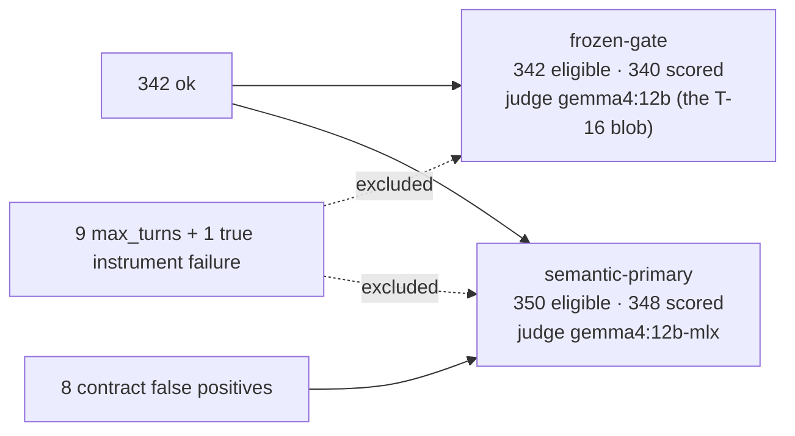

# The experiment, start to finish

This is the guide to `docs/`. It tells the experiment as one story, in the order things
happened, and hands off to the detailed doc at each step. Read it first; every number in
it is quoted from the doc or the frozen CSV it links.

**In one paragraph.** An LLM customer-service agent whose instructions come from a
finite-state machine (FSM) was compared with the same model driven by one well-written
system prompt. Both agents had the same model, the same full knowledge base and the same
simulated customers, on 60 frozen scenarios × 3 repetitions. After three pilot rounds that
fixed the *instruments* — not the agents — the experiment ran on 2026-09-14. The
pre-declared LLM judge found no detectable difference in task completion or claim support and a lower
`fact_f1` for the FSM, which a post-hoc decomposition traces to the FSM stating fewer of
the expected facts, not to more hallucination. A blinded human census of the same 348
dialogues found no detectable difference in task completion or `fact_f1`, and a small, fragile
advantage for the FSM in claim support. The thesis uses the human result as its reference;
that choice was made after unblinding and is declared as such.

## How to read these docs

| Step | Doc | The question it answers |
|---:|---|---|
| 1 | [`fsm.md`](fsm.md) | What is the machine, and how does it drive the FSM agent? |
| 2 | [`taxonomy.md`](taxonomy.md) | What are the 60 scenarios, and how were they written? |
| 3 | [`metrics.md`](metrics.md) | What is measured, what is confirmatory, how are the tests run? |
| 4 | [`setup.md`](setup.md) | Which machines and models, and why? |
| 5 | [`pilot.md`](pilot.md) | What did the pilots break, and what was fixed? |
| 6 | [`parity.md`](parity.md) | What is held equal between the two agents? |
| 7 | [`judge_validation.md`](judge_validation.md) | Does the judge agree with a human? |
| 8 | [`execution.md`](execution.md) | How did the experiment run, and what was adjudicated? |
| 9 | [`audit.md`](audit.md) | Which dialogues are in each exported population? |
| 10 | [`decomposition.md`](decomposition.md) | Where did the `fact_f1` difference come from? |
| 11 | [`decisions_and_limitations.md`](decisions_and_limitations.md) | What can and cannot be claimed? |
| — | [`appendices/`](appendices/) | Paste-ready appendices A–D of the thesis (generated by `just appendices`) |
| — | [`../results/cases.md`](../results/cases.md) | Three exemplar dialogues (T-21) |
| — | [`../results/human_primary/README.md`](../results/human_primary/README.md) | The human census outputs |
| — | [`../results/sensitivity/ambiguous_fact_ids/README.md`](../results/sensitivity/ambiguous_fact_ids/README.md) | The post-hoc tests without the 107 ambiguous fact-ID dialogues (T-25) |

Each doc opens with a navigation line: step, previous, next. The dated decisions behind
every choice live outside this repository, in Portuguese, in `~/Documents/mba/projeto/`
(`TICKETS.md`, `DECISOES.md`, `PROGRESSO.md`); the docs cite them as *DECISOES
yyyy-mm-dd*. The repository names used in those files are mapped in
[`ai-assistance/PREAMBLE.md`](../ai-assistance/PREAMBLE.md).

## 1. The question

Does a finite-state machine used as the **instruction base** of an LLM customer-service
agent beat one well-written system prompt? The domain is a fictitious online shop,
Northlight Store, with four requests — order tracking, exchange or return, cancellation,
and the reissue of a payment slip — and a knowledge base of 37 atomic facts (F01–F37),
6 hard-to-find "needle" facts and 10 plausible questions the knowledge base does not
answer.

The treatment is the **structure of the instruction**, as a package: explicit states,
transitions, guards, a classifier of the customer's event, and a short instruction
package per state. Everything else is held equal ([`parity.md`](parity.md)), including the
knowledge base: both agents see all 37 facts all the time. So the design estimates the
effect of instruction structure for one model and one knowledge base; it says nothing
about FSMs that also change retrieval, tools or the model.

## 2. Two agents, one difference

Both agents share the persona, tone and general rules word for word
(`data/prompts/agent_shared.md`), the model, the temperature (0.7) and a per-dialogue seed
that does not depend on which agent is speaking, so on a given scenario and repetition both
meet the same customer. The FSM agent pays one extra small-model call per turn, the
classifier; that cost is part of the treatment, not a leak.

The machine has eight states. In its canonical walk a request goes `greeting →
identification → intent_classification → data_collection → solution → confirmation →
closing`, with `out_of_scope` reachable from every state and `farewell` able to close from
anywhere. Two guards keep the agent in place until the order number and e-mail, and then
the data the request needs, are in hand. The generated diagram, the events, and why one
turn can move the machine at most two edges are in [`fsm.md`](fsm.md).

## 3. What they are tested on

Sixty scenarios, frozen on 2026-09-10 (hash `0778a901…`, [`taxonomy.md`](taxonomy.md)):
three categories × four requests × five scenarios. `happy_path` is a cooperative
customer; `edge` is a legitimate request whose conversation is irregular (vague opening,
mixed requests, a datum never supplied, a change of subject); `adversarial` tries to break
the instructions (a prompt injection carrying a canary token, a question the knowledge base
cannot answer, pressure to bend a policy, an out-of-scope request). Every scenario carries
its answer key: required facts, forbidden facts, a reference answer, a success criterion
and the expected final state. The text was authored in `data/scenarios/plan.yaml` and
copied as written; no model rephrased it.

The customer is itself a model (`qwen3.5:9b`) that sees only a persona, a goal and a
script — never the knowledge base or the answer key. The script is a **mandatory ordered
plan**: the runtime decides whether a message delivered the current beat, and a dialogue
may not end while a beat is owed. A run that loses a beat fails `just adherence` and is
not data.

Each scenario runs under both agents three times (K = 3): 360 dialogues.

## 4. How a dialogue is scored

A blind LLM judge (`gemma4:12b` family, a different family from the agents) reads each
clean transcript twice — once for facts and claims, once for a global judgement — and
never sees the agent's name, its states or its prompt. Deterministic evaluators add
safety (canary, forbidden sentence), efficiency (turns, latencies) and flow adherence,
the last one from a stage labeler that reads **both** agents' dialogues the same way.
The per-dialogue diagram and one card per column are in [`metrics.md`](metrics.md).

Three metrics carry the confirmatory claim, Holm-adjusted as one family, declared before
any result:

- `task_completed` — did the dialogue meet the scenario's success criterion?
- `fact_f1` — did the facts stated match the set this scenario expected? (Correspondence
  to an expected set, not a hallucination rate.)
- `claim_support` — of the checkable claims made, what share does the knowledge base
  support?

`flow_adherence` is scored against the FSM's own flow, so it is a **diagnostic** of
mechanism, never evidence that one architecture wins. The unit of analysis is the
**scenario**: repetitions are averaged first and the tests pair the two agents over the
scenarios (Wilcoxon signed-rank, a sign-flip permutation test for ties, Kerby
rank-biserial, bootstrap CIs, wins/ties/losses).

## 5. Where it ran

The plan put `run` on the MacBook Air M4 24 GB and `eval` on the MacBook Pro M5 16 GB,
after measuring that the Pro cannot keep the agent and the simulated user loaded together.
The pipeline between machines was an optimization, never a dependency, and in the end the
documented fallback ran: **everything on the Air**, with the Pro pulling `runs/` as the
backup copy ([`setup.md`](setup.md), [`execution.md`](execution.md)).

## 6. Making the instruments trustworthy

The pilots existed to break the pipeline before the experiment could, on the same five
scenarios each time ([`pilot.md`](pilot.md)):

What the rounds established:

- **Parity** holds on everything but the instruction structure and the classifier call
  ([`parity.md`](parity.md)).
- **The judge agrees moderately with a human.** On Pilot v2, the round quoted everywhere:
  `task_completed` agreement 0.850 (κ 0.667), `accuracy` 0.750 (weighted κ 0.569),
  `claim_support` 0.733 (κ 0.533). It was never retuned on those sheets
  ([`judge_validation.md`](judge_validation.md)).
- **The stage labeler is the weakest instrument.** Revision 1 matches the FSM's true state
  on 25/39 turns and its path validity on 8/10 dialogues; a revision 2 and a 9B variant
  were tested and rejected. That is one reason `flow_adherence` is only diagnostic.

## 7. The experiment and the audit

On 2026-09-14 the 360 dialogues ran: 342 `ok`, 18 `failed`. Nine failures were the known
kind (the customer's script could not finish within `max_turns`); nine were a new
instrument class, so the post-run gate stopped. Reading those nine transcripts before any
judge call showed that eight had delivered the scenario content even though the runtime's
beat ledger never closed; they were admitted to a second population. That produced two
frozen populations, each evaluated by its own judge backend:

Semantic-primary is the population the confirmatory tests use; frozen-gate is its
sensitivity check. The MLX judge was not the blob validated in T-16, so on 2026-09-20 it
was re-checked against the same Pilot v2 human sheets (dialogue-level agreement rose,
response-level agreement fell slightly). Two dialogues in each population stayed unscored
because the labeler returned one label too many. Details: [`execution.md`](execution.md),
[`audit.md`](audit.md).

## 8. Results

**Judge, semantic-primary, 59 paired scenarios** (`adversarial_12` has no baseline arm).
Differences are FSM − baseline; W/T/L counts scenarios where the FSM won, tied or lost.
Source: `results/exp_final/tests.csv`.

| Metric | Mean difference | 95% CI | p (Holm) | W/T/L |
|---|---:|---|---:|---|
| `task_completed` | −0.011 | [−0.085, 0.065] | 1.000 | 9/39/11 |
| `fact_f1` | −0.059 | [−0.103, −0.017] | 0.013 | 15/7/37 |
| `claim_support` | +0.004 | [−0.021, 0.031] | 1.000 | 20/23/16 |
| `flow_adherence` (diagnostic, no Holm) | +0.186 | [0.088, 0.280] | — | 33/15/11 |

The frozen-gate population and the drop-five-scenarios sensitivity check reach the same
conclusions: a lower `fact_f1` for the FSM (unadjusted p ≈ 0.002 in both) and no
detectable difference in the other two. Categories are exploratory; the tables and three exemplar
dialogues — `adversarial_08` (the FSM helped), `edge_05` (it restricted), `happy_path_07`
(a tie) — are in [`../results/cases.md`](../results/cases.md).

**Where the `fact_f1` gap comes from** ([`decomposition.md`](decomposition.md), post hoc):
false positives did not move; true positives fell. The FSM stated fewer of the facts each
scenario expected (and none of them twice as often: 32/175 dialogues against 16/173), said
fewer checkable things overall, and made *fewer* unsupported claims. It is a coverage
effect, not evidence that the FSM hallucinates more.

**Human census, same 348 dialogues** (blind IDs, sheets frozen 2026-09-20T21:11:58Z before
unblinding; source `results/human_primary/tests.csv`):

| Metric | Mean difference | 95% CI | p (Holm) | W/T/L |
|---|---:|---|---:|---|
| `task_completed` | −0.006 | [−0.099, 0.085] | 1.000 | 12/35/12 |
| `fact_f1` | −0.004 | [−0.068, 0.059] | 1.000 | 29/6/24 |
| `claim_support` | +0.047 | [0.003, 0.090] | 0.048 | 39/0/20 |

Human and judge agree on the direction of all three metrics and on significance only for
`task_completed`: the judge's `fact_f1` deficit is not reproduced by the human labels, and
the human `claim_support` advantage is not seen by the judge. Agreement on the census:
`task_completed` 89.4% (κ 0.729); the three-way claim-support label 45.4% (κ 0.102).

**Without the 107 ambiguous fact-ID dialogues** (T-25, requested after the results; post hoc
and exploratory; source `results/sensitivity/ambiguous_fact_ids/tests.csv`). In 107 of the
348 dialogues an extra GGUF judge call reproduced the same score with other predicted fact
IDs, so they stay out of the fact-ID agreement. Dropping them from both instruments leaves
56 paired scenarios; Holm over the three primaries is a reference only.

| Metric | Judge: difference [95% CI], p Holm | Human: difference [95% CI], p Holm |
|---|---|---|
| `task_completed` | −0.051 [−0.140, 0.039], 0.440 | +0.006 [−0.101, 0.116], 1.000 |
| `fact_f1` | −0.075 [−0.131, −0.022], 0.060 | −0.001 [−0.089, 0.085], 1.000 |
| `claim_support` | −0.008 [−0.046, 0.027], 0.830 | +0.045 [−0.011, 0.100], 0.180 |

The judge's `fact_f1` interval stays below zero while its reference Holm p rises above 0.05;
the human `claim_support` interval now includes zero.

**How the conclusion is stated.** The judge is the pre-declared confirmatory instrument.
The human census re-ran the same Holm family and was chosen as the narrative reference for
the thesis after both results were visible — a declared, not pre-registered, choice. On
that reference the FSM shows no difference in task completion or expected-fact coverage,
and a small advantage in claim support whose interval excludes zero by a narrow margin
(p Holm = 0.048): a fragile result, delimited to claim support, whose interval no longer
excludes zero once the 107 ambiguous fact-ID dialogues are dropped.

## 9. What this does and does not show

The full list, each with its mitigation, is
[`decisions_and_limitations.md`](decisions_and_limitations.md). The ones that bound the
conclusion most:

- one agent model and one small knowledge base, in English only;
- synthetic, authored scenarios and a simulated customer, not production traffic;
- a judge blind to metadata but not to style — the FSM's step-by-step walk is visible in
  the transcript — with moderate agreement, and a backend in T-17 that differs from the one
  first validated;
- a single human annotator for the census, whose choice as reference came after unblind;
- 59 paired scenarios: the design was planned to detect a standardized paired difference
  of about dz ≈ 0.37 at 80% power with N = 60, so small effects can be missed.

## Names used across the docs

| Name | Meaning |
|---|---|
| First pilot | T-15 pilot of 2026-09-11 at `runs/exp_pilot`; exposed four instrument defects; its judge-validation draw is void |
| Pilot v1 | corrected pilot of 2026-09-13 at the same logical path (`exp_pilot_fixes_20260913_final_v1`); the T-16 frame for parity and the first agreement table |
| Pre-flight | the 120-dialogue QA sweep of all scenarios; accepted 2026-09-14; never judged |
| Pilot v2 | `runs/pilot_v2`, 2026-09-14; the T-16 closure and the quoted agreement |
| `exp_final` | the T-17 experiment, 360 dialogues |
| frozen-gate | population of `status=ok` dialogues only (342 eligible, 340 scored), judge `gemma4:12b` |
| semantic-primary | frozen-gate plus eight adjudicated transcripts (350 eligible, 348 scored), judge `gemma4:12b-mlx`; the confirmatory population |
| `human_primary` | the same 348 dialogues scored from the human census |
| `drop5_instrument` | sensitivity check without the five scenarios that had an instrument failure |
| `drop_ambiguous_fact_ids` | post-hoc, exploratory check without the 107 dialogues whose judge fact IDs are ambiguous (T-25) |
| CFP / TIF | `CONTRACT_FALSE_POSITIVE` (admitted) / `TRUE_INSTRUMENT_FAILURE` (excluded) |
| beat | one step of a scenario's script, delivered by the runtime |
| V/E/D, W/T/L | wins/ties/losses of the FSM per scenario (*vitórias/empates/derrotas* in the thesis) |

Installation, commands and how to regenerate every table and figure without rerunning the
experiment are in the [repository README](../README.md).
