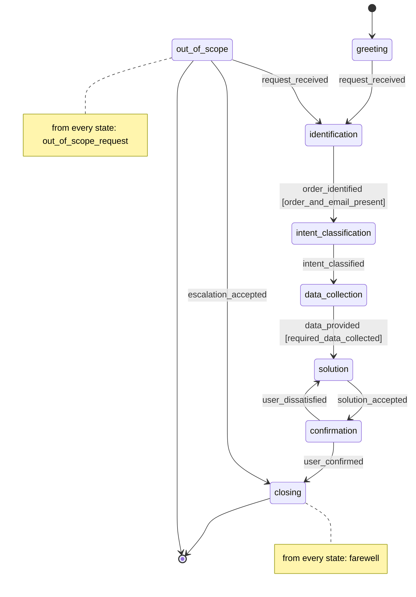

Paste as: Apêndice A — Diagrama da máquina de estados

Source: `data/fsm/machine.yaml`, generated by `just fsm-diagram`.

```mermaid
stateDiagram-v2
    [*] --> greeting
    greeting --> identification : request_received
    identification --> intent_classification : order_identified [order_and_email_present]
    intent_classification --> data_collection : intent_classified
    data_collection --> solution : data_provided [required_data_collected]
    solution --> confirmation : solution_accepted
    confirmation --> closing : user_confirmed
    confirmation --> solution : user_dissatisfied
    out_of_scope --> identification : request_received
    out_of_scope --> closing : escalation_accepted
    closing --> [*]
    out_of_scope --> [*]
    note right of out_of_scope
        from every state: out_of_scope_request
    end note
    note right of closing
        from every state: farewell
    end note
```
