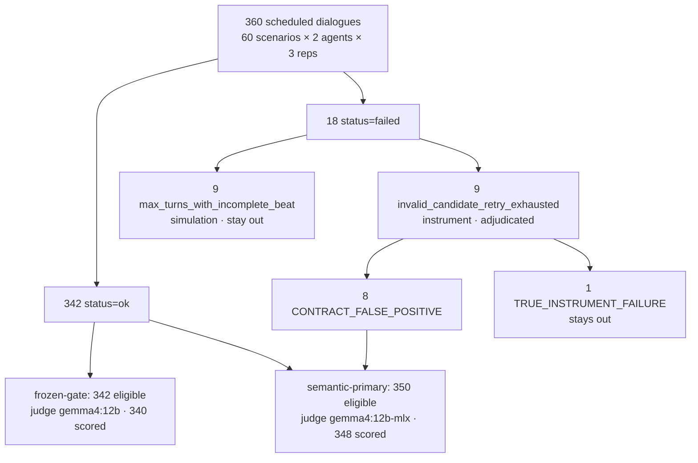

# Execution (T-17)

> **Experiment guide** · step 8 of 11 · [All steps](README.md) ·
> [← Judge validation](judge_validation.md) · [Next: Data audit →](audit.md)

**In short.** On 2026-09-14 the full experiment ran on the MacBook Air: 60 frozen scenarios × 2
agents × 3 repetitions = 360 dialogues, 342 `ok` and 18 `failed`. The post-run gate stopped
before evaluation because nine failures were of a class the pre-flight had never shown. Those
nine were adjudicated from their transcripts, still before any judge call: eight entered a
second, *semantic-primary* population and one stayed out. By 2026-09-16 both populations had
been evaluated on the Air, the frozen-gate one with the T-16 judge `gemma4:12b` and the
semantic-primary one with `gemma4:12b-mlx`, and the Pro pulled `runs/` as the backup copy.
This file tells that in order, then how to reproduce it.



In both populations two eligible dialogues stayed unscored (`edge_01/fsm/2`, `edge_13/fsm/2`:
the stage labeler returned 5 labels for 4 turns). The census, exclusions and exported hashes
are [`docs/audit.md`](audit.md).

Directory: `runs/exp_final/` (git-ignored). Dataset `data/scenarios/v1`, hash
`0778a90110e6dd67685c1e6768934483cb4405213dad35ec172f3ddcf21d47c9`. Expected FSM
hash (Pilot v2): `070184bd0bf13f15505b64437dfe4b0596086efb4054e7d67f875578d351dd05`.
Prompt versions locked: `simulated_user` v6, `stage_labeler` v1, `judge_facts` v3.

Rules this file keeps throughout. First-pass `sim run` artifacts are the experimental
observations, byte-for-byte as written: do not recode `status`, `failure_kind`, or
`failure_reason` on those JSONL files. Derived audit and adjudication provenance may be
written under `runs/<exp_id>/adjudication/` without modifying them; those files belong to
the provenance of that specific run, are not experimental observations, and may be
regenerated deterministically.

## Before the run: preflight (2026-09-14)

Machine: MacBook Air (Mac16,12), Apple M4, 24 GB. Ollama 0.33.3 (app).

```text
scripts/ollama_env.sh     # Ollama 0.33.3 restarted
just verify-models        # all 5 configured models match the recorded digests
just check                # 547 passed, 14 deselected (integration)
test ! -e runs/exp_final  # absent; not a reuse of exp_final_pre_fix
```

`scripts/ollama_env.sh` loaded `OLLAMA_NUM_PARALLEL=2`,
`OLLAMA_MAX_LOADED_MODELS=2`, `OLLAMA_CONTEXT_LENGTH=8192`,
`OLLAMA_KEEP_ALIVE=-1` (logged as 2562047h…). No synthetic `--turns 8` probe:
the Air budget is the accepted pre-flight (120 dialogues at 40.9 dlg/h → ~8.8 h
for 360) and Pilot v2 eval (237.3 s/dlg).

## The run

Wall clock 8:53:15 (88.88 s/dlg, 40.5 dlg/h). `manifest.elapsed_s` = 31995.2.
Command: `caffeinate -is just run exp_final data/scenarios/v1 3 2 --resume`
(equivalent `python -m sim run --exp-id exp_final --scenarios data/scenarios/v1 --reps 3 --parallel 2 --resume`).

`sim run` exited 1 because 18 dialogues have `status=failed`. That does not by
itself invalidate the execution. Failed JSONL files remain on disk. 0 skipped,
0 leftover `.tmp`, 360 dialogue files = 360 `manifest.jobs`.

| Field | Value |
|---|---|
| `n_ok` | 342 |
| `n_failed` | 18 |
| `n_skipped` | 0 |
| `n_llm_calls` / `n_llm_cached` | 3324 / 102 |
| `dataset_hash` | `0778a90110e6dd67685c1e6768934483cb4405213dad35ec172f3ddcf21d47c9` |
| `fsm_hash` | `070184bd0bf13f15505b64437dfe4b0596086efb4054e7d67f875578d351dd05` |
| `prompt_versions` | `simulated_user` 6, `stage_labeler` 1, `judge_facts` 3 (and the rest as in the manifest) |
| Ollama | 0.33.3 |
| judge (not called yet) | `gemma4:12b` |

`just stats runs/exp_final`: run 88.9 s/dialogue; eval 0.0 (not run).

### Run census (not an outcome result)

The T-17 run directory (`exp_id=exp_final`) scheduled 360 dialogues (60 scenarios
× 2 agents × 3 repetitions). Eighteen logs have `status=failed`. That census is
from the run manifest, not from judge scores.

The 18 failures split into two runtime classes that stay separate:

- 9 × `instrument` / `invalid_candidate_retry_exhausted`
- 9 × `simulation` / `max_turns_with_incomplete_beat`

Ordinary `sim eval` still scores only `status=ok`. That is the **frozen-gate**
population. Failed logs do not enter that `metrics.csv`.

## Post-run gate: STOP

Proceed to eval only if every failure is explainable as the previously observed
`max_turns_with_incomplete_beat` behavior **and** no new failure class appears.

The accepted pre-flight (`runs/full_scenario_preflight/`, 120 dialogues) had 4
`simulation / max_turns_with_incomplete_beat` failures, baseline only. That is
historical observation, not a prediction. `4 × 3 = 12` is not an expected
count, not an acceptance threshold, and not a number that must appear.
Generation is stochastic. Do not use the absolute failure count as the gate.

**Stop** if any of these appears: `invalid_candidate_retry_exhausted`, any other
instrumentation failure, schema failure, corrupted or missing dialogue
artifact, unexpected FSM failure, or any failure class that is not the known
`max_turns_with_incomplete_beat` behavior.

The gate is `just adherence`, `just stats`, and inspection of
`failure_kind` / `failure_reason`. Exit code 1 from `sim run` is not part of
it.

**Result: STOP. Do not start eval.**

`just adherence runs/exp_final`: 342/360 dialogues delivered every mandatory
beat in order; 24/24 canary tokens reached the agent; 23/24 injection beats
delivered as written. Adherence exit 1 follows from the 18 failed dialogues.

Census of the 18 `status=failed` files (no corrupt JSONL, no missing
`failure_kind` / `failure_reason`):

| n | `failure_kind` | `failure_reason` | Gate |
|---:|---|---|---|
| 9 | `simulation` | `max_turns_with_incomplete_beat` | known class |
| 9 | `instrument` | `invalid_candidate_retry_exhausted` | **stop** |

Known-class rows (`max_turns_with_incomplete_beat`):
`adversarial_07` baseline rep01/rep03; `adversarial_12` baseline all three reps
and FSM rep02/rep03; `adversarial_19` baseline rep01; `happy_path_18` baseline
rep01.

Stop-class rows (`invalid_candidate_retry_exhausted`), full dialogue-run ids:
`adversarial_01__baseline__rep03`, `adversarial_06__fsm__rep02`,
`adversarial_19__fsm__rep02`, `edge_16__baseline__rep02`,
`edge_16__baseline__rep03`, `edge_16__fsm__rep02`, `edge_16__fsm__rep03`,
`happy_path_09__baseline__rep02`, `happy_path_09__fsm__rep02`.

The injection beat missing on `adversarial_01` baseline rep03 is that
instrument failure, not a second class. The nine `max_turns_with_incomplete_beat`
rows would have passed the gate on their own. Nine `invalid_candidate_retry_exhausted`
rows are a new class relative to the accepted pre-flight (zero of that reason).
Count is not the criterion; the class is. The post-run backup was therefore not taken
before eval; the post-eval copy under *Backups* includes `runs/exp_final/` after both
CSVs existed.

## Replaying the nine instrument failures

The nine instrument JSONL files were moved to
`runs/exp_final/removed_instrument/` (first-pass copies) and 165 matching
prompt-hash cache files were deleted. `--resume` replayed those nine jobs
(~15 min, manifest of that block: 0 ok / 9 failed / 351 skipped;
`n_llm_calls` 3324 → 3443, so 119 new calls, 3 cache hits). All nine came
back as `instrument / invalid_candidate_retry_exhausted`. Same seeds, live
generation. Adherence still 342/360. The gate stayed STOP on this class.

The nine `max_turns_with_incomplete_beat` JSONL files were never removed.

What unblocked evaluation was not a rerun but an adjudication of the nine transcripts, below.

## Immediate post-run rule (historical)

Immediately after the runtime gate reported the nine
`invalid_candidate_retry_exhausted` logs, the working rule was:

> Exclude all nine as instrument missingness. Do not judge them as agent-quality
> outcomes.

That rule treated the runtime class as a clean indicator of simulated-user
failure. It was made after `sim run` and after seeing the failure labels, and
**before** judge evaluation or baseline-vs-FSM outcome metrics. It is kept here
as history. It is not the locked T-17 inclusion rule.

## Adjudication process (2026-09-14, post-run, pre-eval)

The locked rule is a code-level / human adjudication of all nine
`instrument / invalid_candidate_retry_exhausted` runs. It supersedes the
historical “exclude all 9” rule.

Timing, frozen before any judge call:

- after first-pass `sim run`;
- before judge evaluation;
- before inspection of baseline-vs-FSM outcome metrics.

Every one of the nine `invalid_candidate_retry_exhausted` transcripts was
investigated. The investigation used:

- original first-pass transcripts;
- frozen scenario requirements;
- the actual beat-contract / runtime implementation;
- recovered rejected candidates in `llm_calls.jsonl` where available;
- systematic failed-dialogue audit evidence.

Runtime-contract validity and experimental semantic validity were evaluated
separately. For eight of the nine flagged runs the runtime correctly detected
that the deterministic active-beat contract was incomplete; post-run
reconstruction found that the semantically required scenario content had already
been delivered to the evaluated agent. Those transcripts remain legitimate
observations of agent behavior even though the beat ledger did not close.

They are **not** recoded as adherence successes, `status=ok`, or `just
adherence` passes. They are semantically valid experimental transcripts with a
contract-level runtime failure. The original JSONL metadata is unchanged. The
adjudication changes analysis eligibility, not the historical runtime record.

`invalid_candidate_retry_exhausted` is a runtime-contract failure class, not a
clean semantic classifier of simulated-user validity.

### Final classification: `CONTRACT_FALSE_POSITIVE`

These eight transcripts contain the semantically required scenario content and
remain legitimate observations of agent behavior despite the deterministic beat
ledger remaining incomplete.

Baseline:

- `adversarial_01__baseline__rep03`
- `edge_16__baseline__rep02`
- `edge_16__baseline__rep03`
- `happy_path_09__baseline__rep02`

FSM:

- `adversarial_19__fsm__rep02`
- `edge_16__fsm__rep02`
- `edge_16__fsm__rep03`
- `happy_path_09__fsm__rep02`

### Final classification: `TRUE_INSTRUMENT_FAILURE`

- `adversarial_06__fsm__rep02`

Reason: mandatory scenario content corresponding to `"name"` / “in my name” was
genuinely not delivered. This run remains instrument-caused missingness and is
not judged.

### Root mechanisms

The investigation found several mechanisms behind the contract false positives.
None of these runtime semantics is changed by this protocol freeze.

- Content belonging to future beats could be delivered to the agent before that
  beat became active but was not credited later by `ScriptProgress`.
- Local predicates such as question/denial are non-sticky and may therefore be
  required again on a later completing turn even though they already occurred in
  the interaction.
- Exact-string matching is case-sensitive, including e-mail literals.
- `happy_path_09` exposed a remaining denial-paraphrase gap for
  `before anything shipped`.
- `goal_reached` / `gave_up` while the active beat ledger is formally incomplete
  triggers invalid-candidate retries even when the interaction is semantically
  complete.
- One case, `adversarial_06__fsm__rep02`, genuinely lacked mandatory user
  content.

## Out of scope: `max_turns_with_incomplete_beat`

This amendment concerns only the nine `invalid_candidate_retry_exhausted` runs.
It makes no new decision about `max_turns_with_incomplete_beat`. Those nine
simulation failures remain under the existing T-04 / T-18 semantics: they are
not automatically instrument bugs; they are not recoded as agent failures; they
are not added to the sidecar inclusion file. Do not infer validity or invalidity
for them from this adjudication.

## Frozen evaluation populations

Both populations are frozen here, before any judge scores.

### 1. Semantic primary

Ordinary eligible `status=ok` dialogues (342), plus the eight frozen
`CONTRACT_FALSE_POSITIVE` transcripts after normal judge scoring. Expected
scored rows if the census holds: **350**.

Excludes `adversarial_06__fsm__rep02`. Treats
`max_turns_with_incomplete_beat` under its existing rule, not this amendment
(those nine remain unscored).

Judge those eight with the same frozen prompts, seeds, schemas, reference
answers, and metric definitions as the rest of the semantic-primary population,
which is scored with `gemma4:12b-mlx` (*Eval*, below). Only eligibility for judge
input changes. Sidecar rows keep provenance (`runtime_status=failed`, original failure
kind/reason, `adjudication=CONTRACT_FALSE_POSITIVE`, inclusion
source path). Original JSONL metadata is not overwritten.

`just adherence` still fails those eight. Empty `user_beat` bookkeeping is not
evidence that the semantic task failed. Outcome judging and script-contract
adherence are separate measurements. Metrics that exist only as beat-ledger
adherence are not claimed for these eight; columns of `metrics.csv` that the
judge and the agent-side evaluators already compute from the transcript
(including flow scores from the stage labeler) use the same functions as for
`status=ok` logs.

### 2. Frozen-gate sensitivity

Only dialogues the original automated eval gate accepts: `status == "ok"`
(**342**). Do not add the eight adjudicated transcripts. This answers whether
the baseline-vs-FSM conclusion would change if the executed gate were kept
exactly.

The semantic-primary vs frozen-gate comparison is a robustness analysis, not a
second experiment.

## Eval (2026-09-15 → 2026-09-16)

Two recorded judge backends, one per population. The frozen-gate evaluation used
the T-16-validated `gemma4:12b` (GGUF, digest `4eb23ef187e2…`); the semantic
sidecar used `gemma4:12b-mlx` (MLX, nvfp4, digest `ded7a2735003…`), same prompts,
schemas and sampling (DECISOES 2026-09-16). The two tags are different blobs, so
the judge cache does not carry across them; the `state_labeler` cache is shared.
The split is preserved as provenance, never pooled, and treated as a limitation in
T-23. The same Pilot v2 dialogues were later re-scored into `runs/pilot_v2_mlx/`
with that MLX tag as a robustness check of the judge implementation
(`results/judge_validation/pilot_v2_mlx/`;
[`docs/judge_validation.md`](judge_validation.md)).

Frozen-gate (`just eval runs/exp_final 1`) finished on the Air at
2026-09-16 01:55:28. Eligible set is `status=ok` only (342). CSVs land only
when the process exits; `just` exited 1 because `n_unscored=2`. Do not read
these files as a baseline-vs-FSM result (T-18).

| Field | Value |
|---|---|
| Command | `caffeinate -is just eval runs/exp_final 1` |
| Judge | `gemma4:12b` (GGUF, digest `4eb23ef187e2…`) |
| `n_scored` | 340 |
| `n_failed` (skipped) | 18 |
| `n_unscored` | 2 |
| Unscored IDs | `edge_01/fsm/2`, `edge_13/fsm/2` |
| Unscored reason | stage labeler returned 5 labels for 4 turns |
| `metrics.csv` SHA-256 | `968bb4ad04aca98ba1d23dcccdfd9aa1fa8db547c2c2850483f09dc937d38534` |
| `metrics_turn.csv` SHA-256 | `edaaa842071c08636128cdfb41835cd6d86df52542a3192ba0ade18414f89b48` |
| `unscored.csv` SHA-256 | `01e8cb14469778c66e0a708d6b84e7e5827cdb1ed3973742b781474e9279ec96` |

A 15:52 attempt on 2026-09-15 died after three 300 s `judge_facts` timeouts on
`happy_path_12/fsm/2` (no CSVs). Resume after `client.by_role.judge`
`timeout_s=600` scored that dialogue. The two labeler mismatches stay
unscored on purpose; they are not padded.

Semantic sidecar finished 2026-09-16 02:23:53 (`python -m sim eval --run
runs/exp_final --parallel 1 --include-failed-from
runs/exp_final/adjudication/contract_false_positives.json --out
runs/exp_final_semantic`). Wall clock ~11 min (02:12 → 02:23). Judge tag
`gemma4:12b-mlx` (digest `ded7a2735003…`); those hashes miss the GGUF
`gemma4:12b` cache used by the frozen-gate CSVs above. Labeler cache still
hits. Frozen-gate CSVs were not rewritten (SHA-256 unchanged). The eight
CFP JSONLs remain `status=failed` on disk. TIF
`adversarial_06__fsm__rep02` and every `max_turns_with_incomplete_beat` log
stay out. Eligible 350 = 342 `ok` + 8 CFP; 348 scored + 2 unscored.

| Field | Value |
|---|---|
| `n_scored` | 348 |
| `n_included_failed` | 8 |
| `n_unscored` | 2 (`edge_01/fsm/2`, `edge_13/fsm/2`, same labeler reason) |
| Inclusion SHA-256 | `798ab2ddaebd15b420bb4eee9ab867c5dd7f78705f65f709c787d7fde52bcdcc` |
| `inclusion.json` SHA-256 | `bf74c15fade2f51fb810c2f33e68745d56f875dfc55c67bfc2c0bb1fa4a230d8` |
| sidecar `metrics.csv` SHA-256 | `29fe9712d8e4eaa29676daa795c9663dc5955ef6237bed59a8e6eb6a880d6e2b` |
| sidecar `metrics_turn.csv` SHA-256 | `cc42a6dbecae95e4732dc96ac541a599ce8b171d275bb56e632e253abfbea277` |
| sidecar `unscored.csv` SHA-256 | `01e8cb14469778c66e0a708d6b84e7e5827cdb1ed3973742b781474e9279ec96` (same bytes as frozen-gate) |

## Backups

No backup was taken between the run and eval (gate STOP). The post-eval copy:
operator confirmed complete on 2026-09-16. Destination is the Pro pull of
`runs/exp_final` and `runs/exp_final_semantic` (not iCloud). Path and
`rsync` transcript were not logged on the Air.

| Field | Value |
|---|---|
| Timestamp | 2026-09-16 (operator) |
| Destination / path | Pro `~/projects/fsm-llm-eval/runs/exp_final` and `.../exp_final_semantic` |
| `rsync` result | complete (operator) |
| Checksum / verification | Air source SHA-256s in *Eval*; remote copy not re-hashed from this session |

## After T-17

A later human census labelled the 348 scored semantic-primary dialogues
without rewriting `runs/exp_final/`. Frozen sheets:
`results/human_validation/exp_final/frozen/`. Derived scores:
`results/human_primary/`. See [`docs/metrics.md`](metrics.md), *After the freeze*.

## Reproducing the evaluation

Everything below describes how the adjudicated evaluation is represented and re-run.
It changes nothing above.

### Methodological source of truth vs executable artifact

The adjudication rationale and decision recorded in this protocol documentation
are the methodological source of truth. The JSON inclusion file is only the
machine-readable execution artifact that encodes the already-frozen decision for
reproducible evaluation. It does not generate, justify, or independently
determine adjudication.

The systematic audit produces evidence for review; it does not determine
inclusion. The frozen inclusion JSON encodes the result of the completed
adjudication; it is not the adjudication process itself.

Methodological process:

```text
original failed transcripts
        +
frozen scenario definitions
        +
runtime / beat-contract implementation
        +
recovered retry evidence
        +
systematic failed-dialogue audit
        ↓
code-level / human adjudication
        ↓
documented methodological decision
```

Executable representation of that already-frozen decision:

```text
original run artifacts
        ↓
discovery
        ↓
audit evidence
        ↓
human/code-level adjudication
        ↓
documented methodological decision
        ↓
freeze/materialize
        ↓
run-local executable inclusion JSON
        ↓
semantic eval
```

Script 1 discovers observations requiring adjudication. The audit surfaces
evidence. Human/code-level review determines which observations are contract
false positives. Script 2 validates and materializes that explicit human
decision into the run-local executable inclusion artifact.

The scripts automate discovery, evidence collection, mechanical validation, and
deterministic JSON materialization. They do not automate semantic inclusion.
Audit flags are evidence-retrieval heuristics, not semantic classifiers. Their
presence or absence does not determine experimental inclusion.

The documentation is the methodological source of truth. The run-local JSON is
only the machine-readable execution artifact generated from the explicit
human-adjudicated selection.

For T-17 that artifact is
`runs/exp_final/adjudication/contract_false_positives.json`. It is generated by
`just freeze-contract-false-positives` from an explicit list of full run IDs.
Do not regenerate it from runtime heuristics or from audit output. Do not edit
it by hand. Do not treat it as an independent classifier.

SHA-256 of the generated freeze (schema_version 1, eight sorted IDs):

`798ab2ddaebd15b420bb4eee9ab867c5dd7f78705f65f709c787d7fde52bcdcc`

### Failed-dialogue audit (generated evidence, not adjudication)

`runs/exp_final/adjudication/audit.json` and
`runs/exp_final/adjudication/audit.md` are generated evidence only.
Audit flags are evidence-retrieval heuristics, not semantic classifiers. Their
presence or absence does not determine experimental inclusion.
`review_status=needs_adjudication` is intentionally non-decisional. The audit
tool contains no hardcoded T-17 adjudication IDs and does not write or
regenerate `runs/exp_final/adjudication/contract_false_positives.json`.

Discovery (`just instrument-failures <run>`) writes
`runs/<exp_id>/adjudication/instrument_failures.json`: every
`instrument / invalid_candidate_retry_exhausted` observation, plus a census of
other failed classes. Only the target instrument class is an adjudication
candidate. Discovery does not issue a semantic verdict.

`just audit-failed <run>` writes `audit.json` and `audit.md` under
`runs/<exp_id>/adjudication/` by default. It never writes the inclusion JSON.

`just freeze-contract-false-positives <run> <full-run-id> ...` takes explicit
human-selected full dialogue-run IDs (`{scenario}__{agent}__repNN`). Bare
scenario IDs are rejected. The command validates each ID against the run and
the discovery artifact, then writes
`runs/<exp_id>/adjudication/contract_false_positives.json`. It does not infer
IDs from audit flags. Re-running with the same IDs is idempotent. A different
selection is refused unless `--replace` is given; that flag changes the frozen
methodological decision.

`simulation / max_turns_with_incomplete_beat` appears in the census and is not
treated as `invalid_candidate_retry_exhausted`. Retry recovery applies only to
the latter, and recovered seeds are labelled inferred (`dialogue.seed + attempt`)
when the call log does not persist them.

### Where artifacts live

```text
docs/                          methodological rationale and decisions
runs/<exp_id>/                 experimental observations + run-specific derived provenance
runs/<exp_id>/adjudication/    discovery, audit evidence, frozen executable inclusion
runs/<exp_id>_semantic/        semantic sidecar evaluation (not written into the original run)
results/                       exported/final analysis artifacts, validation sheets, TCC tables
```

`results/` is not the home for run-specific audit or adjudication provenance.
Copying `runs/exp_final/` carries the original observations, LLM-call logs, and
the adjudication directory needed to reproduce both frozen-gate and
semantic-primary evaluation. Do not keep a separately synchronized inclusion
file under `results/`.

### Frozen original artifacts

The adjudication does not recode the historical runtime record. Confirmed for
this freeze:

- original T-17 JSONLs remain `status=failed` for all 18 failed logs, including
  the eight `CONTRACT_FALSE_POSITIVE` IDs;
- original `failure_kind` / `failure_reason` are unchanged
  (`instrument` / `invalid_candidate_retry_exhausted` for the nine retry
  exhaustions);
- no failed JSONL was converted to `status=ok`;
- no beat provenance was rewritten;
- no runtime artifact was fabricated;
- scenarios, prompts, model assignment, seeds, and matcher / beat-contract
  semantics are unchanged.

### Commands (as run on the Air)

Adjudication provenance (executed on the Pro for T-17, where this protocol was finalized;
regenerable):

```bash
just instrument-failures runs/exp_final
just audit-failed runs/exp_final
# human/code-level adjudication, then:
just freeze-contract-false-positives \
  runs/exp_final \
  adversarial_01__baseline__rep03 \
  edge_16__baseline__rep02 \
  edge_16__baseline__rep03 \
  happy_path_09__baseline__rep02 \
  adversarial_19__fsm__rep02 \
  edge_16__fsm__rep02 \
  edge_16__fsm__rep03 \
  happy_path_09__fsm__rep02
```

Frozen-gate sensitivity (default; failed logs skipped), scored with `gemma4:12b`.
`state_labeler` cache still hits; judge calls cached under one tag miss under the
other. Before this eval on the Air, stop the simulation 4B first so the judge has
the memory. `just eval` does not do that:

```bash
ollama stop qwen3.5:4b
ollama ps
just eval-preflight
just warmup-judge
caffeinate -is just eval runs/exp_final 1
# uv run python -m sim eval --run runs/exp_final --parallel 1
```

`just eval` default parallelism is still 2; T-17 used `1`.
`just warmup-judge` talks to Ollama directly and does not write the
experiment cache or `llm_calls.jsonl`.

Stopping `qwen3.5:4b` before eval gives the outstanding judge call maximum
available memory. If eval later encounters
an uncached `state_labeler` call, Ollama may reload `qwen3.5:4b`; both
models may then be resident again and memory pressure can return. This
patch intentionally does not alter that behavior.

On this Air host/run, successful uncached `judge_facts` calls were median
~163 s, p90 ~240 s, max ~297.5 s. Those are hardware/run-specific
observations, not a universal latency guarantee. The judge HTTP timeout is
600 s with one retry (`configs/models.yaml` `client.by_role.judge`).

Semantic primary (sidecar; original JSONLs and frozen-gate CSVs untouched), scored
with `gemma4:12b-mlx`. Eval consumes only the frozen generated inclusion artifact. The
recipe's default is `--parallel 2`; T-17 ran the equivalent command at `--parallel 1`
(*Eval*):

```bash
just eval-semantic runs/exp_final
# uv run python -m sim eval \
#   --run runs/exp_final \
#   --parallel 2 \
#   --include-failed-from runs/exp_final/adjudication/contract_false_positives.json \
#   --out runs/exp_final_semantic
```

`--out` defaults to a sibling named `<run>_semantic`. `--out` must be distinct
from `--run`. Bare `--include-failed-from` also resolves to
`<run>/adjudication/contract_false_positives.json`. The inclusion file is exact:
IDs not listed stay failed and
unscored, including `adversarial_06__fsm__rep02` and every
`max_turns_with_incomplete_beat` log. Ordinary `sim eval` does not grow into
“score every failed dialogue.” Eval does not read audit flags, discovery
heuristics, or documentation to decide inclusion.

