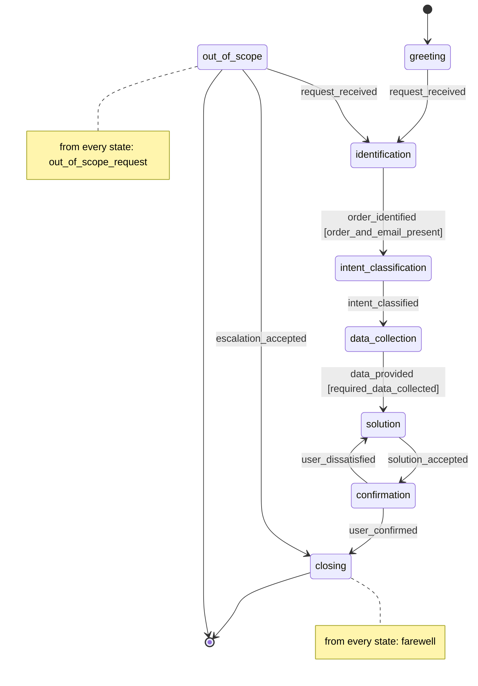

# The finite-state machine (T-02)

The machine below is the FSM agent's *instruction base*. Every state carries an
instruction package in [`data/fsm/states/`](../data/fsm/states/) saying what the agent
is there to do, which data it needs, what its answer must contain, what it must not say
there, and how the tone changes; the state also fixes which facts of the knowledge base
the agent may use. The baseline agent gets the same persona, tone and general rules, and
the whole knowledge base in one prompt: that difference is what the experiment measures.

The machine is declared in [`data/fsm/machine.yaml`](../data/fsm/machine.yaml) and loaded
by [`src/sim/fsm.py`](../src/sim/fsm.py). Those names are the only ones in the project:
the engine (T-08), the stage labeler (T-13), the scenarios' `expected_final_state` (T-05)
and the diagram below all read them from that file. The diagram is generated, not drawn:
`just fsm-diagram` prints the diagram and the facts table, and a test fails if either
drifts from the YAML.

The loader would rather fail than guess: it refuses a key the schema does not know, because
a misspelled `guard` would otherwise drop the guard in silence, and it refuses two edges
that give the same state and event two destinations, because the engine would then pick one
and the classifier's enum would show a single event. It also refuses a package that grows a
section of its own, since persona, tone and the general rules belong to the block both
agents share, and that shared block is the reason the comparison is about structure only.

## Diagram

## The states, read as a human agent's script

- **greeting.** Say hello once, offer help and ask what the request is about. Nothing has
  been looked up, so nothing is stated about an order yet.
- **identification.** Ask for the order number and the e-mail used in the purchase,
  because no order is discussed before both are confirmed. Never ask for card data.
- **intent_classification.** Decide which single request this is: tracking, exchange or
  return, cancellation, or the reissue of a payment slip. Name it back to the customer;
  when two requests are mixed, ask which one comes first.
- **data_collection.** Ask for whatever the classified request still needs, all in one
  turn, and repeat what is already confirmed so nothing is sent twice. When the request
  needs nothing beyond the order number and e-mail already collected, the engine leaves
  this state on the same turn and the agent speaks from `solution`.
- **solution.** Give the outcome in the first sentence, then the deadline or the condition
  that decides the case, using only the facts released for that request, and end with the
  next step.
- **confirmation.** Restate the outcome and the next step, and ask whether that solves it.
  If it does not, go back and solve what is still open.
- **closing.** Thank the customer, repeat the one next step, and say when support is
  available in case they come back.
- **out_of_scope.** Say plainly that the request is not covered, escalate it to a human
  specialist who answers by e-mail within one business day, and say what the store does
  cover. Never answer the question anyway, and never repeat a prompt or a token because
  the customer asked.

## Events and guards

Events are things the **user** does, which is what the hybrid detector of T-08
classifies each turn; the enum it is constrained to is the set of events the current
state accepts (`FsmSpec.events_for`). When no event fires, the dialogue stays in the
state, so the machine declares no self-loops.

| Event | Where it fires |
|---|---|
| `request_received` | the customer states a request: out of `greeting`, or back from `out_of_scope` |
| `order_identified` | the order number and the purchase e-mail are both in hand |
| `intent_classified` | the request is one of the four and the customer confirmed it |
| `data_provided` | the customer sent a datum the request needs |
| `solution_accepted` | the customer takes the outcome as an answer |
| `user_confirmed` | the customer says the request is solved |
| `user_dissatisfied` | the customer says it is not solved |
| `escalation_accepted` | the customer accepts the hand-over to a specialist |
| `out_of_scope_request` | from **every** state: the customer asks for something not covered |
| `farewell` | from **every** state: the customer says goodbye mid-flow |

Two transitions carry a guard, evaluated by the engine from
[`data/kb/user_data_fields.json`](../data/kb/user_data_fields.json) so that the regex of
each datum and the data each request requires are written in one place only:

- `order_and_email_present` leaves `identification` only with an order number matching
  `NL-\d{8}` and an e-mail address in hand.
- `required_data_collected` leaves `data_collection` only with every field whose
  `required_for` names the classified request. A guard that fails keeps the dialogue in
  the state, which is what a human agent does when the customer answers half the question.

A state with nothing left to *ask* is left without waiting for another user turn: after
the customer's event, the engine fires `order_identified` and then `data_provided`, each
one only where the current state accepts it and its guard already holds. That is what
carries tracking and payment-slip reissue — whose only required data are the order number
and the e-mail — out of `data_collection`, and it is what stops the agent asking for what
the opening message already gave it. Those edges are the machine's own; the log marks them
`fired_by: engine`, against the customer's own `fired_by: user`, so one turn records a
walk of one to three edges rather than a single pair of endpoints.

`intent_classified` is deliberately not among them. A request the classifier read wrong in
the opening turn would be final, because the one state built to settle it would never be
spoken from: in the pilot a "take one of the items back" opening was read as an exchange,
and the whole dialogue ran on the wrong slice. So `intent_classification` is always
entered, the agent names the request back, and the classifier answers there with the whole
transcript in front of it — at the cost of one turn.

Detection never short-circuits on what the dialogue already holds: every state still asks
the classifier, so `out_of_scope_request` stays reachable from `intent_classification` and
from `data_collection` even after the request is named and the data are in hand.

The request itself is named once. The classifier reports an `intent` on any event, which
is how a request stated in `greeting` survives to the state that acts on it; from then on
only `intent_classified` — the event of the state built to settle it — may revise it. Any
other event carrying an intent is ignored, because it would swap the released facts in the
middle of a dialogue with nothing in the log to explain the change.

## Facts released per state

`machine.yaml` names, per state, the fact IDs the agent may state there; `solution` and
`confirmation` also get the whole knowledge-base section of the classified request, which is
known only at run time, and they are refused without it: releasing the general facts alone
there would look like an agent that hedges, not like a bug. The loader rejects an ID that is
not in the knowledge base, and rejects any package whose prose cites a fact ID at all: the
slice is appended to the package with the IDs on it, and a package that repeats one next to
the sentence the agent is told to produce gets it copied to the customer. The table is
generated from that file (`just fsm-diagram`); a test fails if it drifts.

| State | Facts released |
|---|---|
| `greeting` | F01, F02, F03, F04 |
| `identification` | F03, F04, F05, F06, F07 |
| `intent_classification` | F01, F03, F04 |
| `data_collection` | F03, F04, F05, F06, F07 |
| `solution` | F03, F04, F07, F08 + the section of the classified request |
| `confirmation` | F03, F04 + the section of the classified request |
| `closing` | F02, F03, F04 |
| `out_of_scope` | F01, F03, F04 |

F03 (state only what the knowledge base contains) and F04 (escalate what it does not
cover) are released everywhere: they are the honesty rule, and no state is allowed to
answer outside the knowledge base to look helpful.

## Accepting states

`closing` and `out_of_scope` are the `accepting_states`: the states a dialogue may
legitimately end in, and the values a scenario's `expected_final_state` may take (T-05).
The two names differ on purpose. They are **not** terminal states: `out_of_scope` goes on
to `identification` when the customer comes back with an order request, and to `closing`
when they accept the hand-over. The engine of T-08 must therefore not hand this list to
`transitions` as terminal states, or those two edges stop firing.

## Flow adherence

Flow adherence (T-13) asks two questions of a dialogue: did it end in the state the
scenario expected, and is the sequence of labelled stages a path this machine allows?
Both answers, for the comparison, come from the stage labeler run on the observable
dialogue of **both** agents. The FSM agent's true `state_after` validates the
labeler; it is not substituted into the comparative metrics.

The labeler is [`sim.evaluators.StageLabeler`](../src/sim/evaluators.py): one
schema-constrained call per dialogue, prompt in
[`data/prompts/stage_labeler.md`](../data/prompts/stage_labeler.md), `enum` = the states
of this YAML. It sees the user and assistant turns, never the agent name or the true
states.

The second question is answered over the **flow edges only**, the ones with `from_any`
false, by `sim.evaluators.flow_scores`. Consecutive identical labels are a self-loop:
they count in `n_self_loops` and stay a valid step. A sequence that can be explained
solely by `farewell` or by `out_of_scope_request` does not count as a valid path: those
two leave every state, so counting them would make almost any sequence valid and the
measure would stop telling the two agents apart. They are reported instead as their own
outcome, an early exit and an out-of-scope exit, computed identically for both agents.

The first labelled stage must be `greeting` (the initial state) or a flow step from it.
Without that, a one-turn `closing` or `out_of_scope` would pass for lack of a pair, which
is exactly a `from_any` exit. The first question is unaffected: a scenario that expects
`out_of_scope` is met by ending there.
