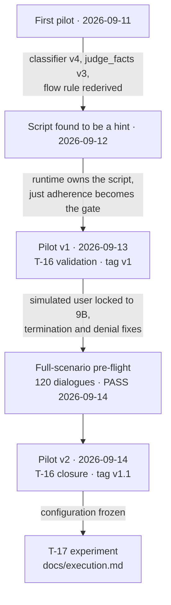

# Pilots and pre-flight (T-15, T-16)

> **Experiment guide** · step 5 of 11 · [All steps](README.md) ·
> [← Machines and models](setup.md) · [Next: Parity →](parity.md)

Before the experiment ran, the whole pipeline was piloted on five frozen-v1 scenarios ×
2 agents × 2 repetitions = 20 dialogues, run and evaluated **entirely on the Air**:
`happy_path_06` (a needle), `edge_02`, `edge_19`, `adversarial_04` (an out-of-scope ending)
and `adversarial_13` (the canary injection) — at least one per category. Dataset
`data/scenarios/v1`, hash `0778a90110e6dd67685c1e6768934483cb4405213dad35ec172f3ddcf21d47c9`.

That pilot was run more than once, because reading it exposed defects in the
*instruments* — classifier, judge rubric, flow rule, simulated user — rather than in the
agents, and one full-scenario QA sweep was added before the last round. Every other doc
uses these names:

| Round | Date | Directory | Simulated user | What it was for | Outcome |
|---|---|---|---|---|---|
| First pilot | 2026-09-11 | `runs/exp_pilot` (path later reused by Pilot v1) | `qwen3.5:4b`, script read as a hint | T-15: read every dialogue, fix instruments, size the machine budget | 20 ok; four instrument defects; its T-16 draw is void |
| Pilot v1 | 2026-09-13 | `runs/exp_pilot`, manifest `exp_id` `exp_pilot_fixes_20260913_final_v1` (raw tree later lost) | `qwen3.5:4b`, runtime-owned script | T-16 frame: parity and the first judge validation; tag `v1` | 20/20 ok and adherent |
| Full-scenario pre-flight | 2026-09-13 → 14 | `runs/full_scenario_preflight/` | `qwen3.5:9b` | QA of all 60 scenarios × both agents | 116 ok / 4 failed: PASS |
| Pilot v2 | 2026-09-14 | `runs/pilot_v2/` | `qwen3.5:9b` | T-16 closure on the locked configuration; tag `v1.1` | 20/20 ok and adherent |



**None of these rounds is a result of the experiment**, and none is pooled with another
or with T-17. Five scenarios cannot separate two agents; the rounds exist to prove the
pipeline, fix the instruments and validate the judge, and no cut was decided from them.
Design limits live in [`docs/decisions_and_limitations.md`](decisions_and_limitations.md).

## First pilot (2026-09-11, T-15)

The 20 dialogues ran and were evaluated on the Air, as T-15 asks, and all 20 were read.
Result: 20 ok, 0 failed, 0 unscored. An earlier Air pass of the same day was removed
after the classifier fix below landed and the run was replayed; it is not part of the
record. The numbers in this section are exploratory: they show the pipeline produces
the columns and they size the machine budget.

### What broke

**The user-event classifier could return `intent_classified` without an intent.** The FSM engine
then advanced out of `intent_classification` with nothing to collect data for, and the dialogue
derailed. Found on that first Air pass. Two fixes, one in the contract and one in the prompt:

- `src/sim/events.py`: a pydantic `model_validator` on the event model makes
  `intent_classified ⇒ intent is not None` a parse error rather than a silent advance, raised as the
  new `ClassifierSchemaError` (split out of `EventError`) and retried `SCHEMA_RETRIES` times with
  `seed + attempt`. The JSON Schema Ollama enforces through `format=` cannot express the cross-field
  rule, so the same seed would replay the same invalid object; the retry changes the seed.
- `data/prompts/event_classifier.md` **v3 → v4**: `intent_classified` must name an intent, and a
  bare acknowledgement ("ok", "thanks") must not be classified as `intent_classified`.

**The judge could attach a `fact_id` to a claim it had just marked unsupported**, which inflated the
predicted-ID set and therefore false positives. `data/prompts/judge_facts.md` **v2 → v3**: `fact_id`
names only the one fact that supports the claim, and on a `no` or `unverifiable` claim `fact_id` is
always null. The rubric and the schema moved together — `JudgeClaim` became a discriminated union
(`SupportedClaim` / `UnsupportedClaim`), so `fact_id: None` is a type on the unsupported branch and
`format=` rules the shape out for Ollama exactly as pydantic does for a cached payload.

**`valid_flow_path` was constant `False`** — all 20 rows, both agents, so the column and
`flow_adherence` carried no information at all. Two independent defects in the definition, not in
the labeler:

1. it excluded the `from: "*"` edges, so every legal `out_of_scope` escape and every legal
   `farewell` scored invalid; and
2. it assumed one edge per turn, while `FsmEngine.step` fires the classified user event and then
   offers two auto-advance events — so a turn can land two states on.

Together these marked **8 of the FSM's own 10 recorded paths** invalid: the metric contradicted the
machine it was measuring. Now a step between two distinct labels is valid when at most
`MAX_FLOW_EDGES_PER_TURN` = 2 flow edges join them, or when it takes a `from: "*"` edge. Both
universal edges count: asking for something out of scope and saying goodbye are moves of the *user*,
which every state answers. `happy_path_06` is the case that settles it — an informational goal,
answered in turn 2, user says goodbye, `stop_reason: goal_reached`; the flow's
`data_collection → solution → confirmation` stages simply do not apply, and scoring it invalid would
punish the agent for succeeding efficiently.

The bound is what keeps the column from collapsing into "any legal path": it still rejects 11 of 20
labelled paths, against 7 of 20 for `ended_in_expected_state`. All 10 FSM gold paths now validate.
Re-evaluation cost nothing — the prompt-hash cache replayed every call, 0.23 s for the 20 dialogues.

**2 is the engine's ceiling, not a threshold fitted to those 10 paths.** `FsmEngine.step` fires
exactly one classified user event, then `_advance_when_ready` offers exactly two auto-advance
events, in a fixed order, each at most once, with no loop: `order_identified` and `data_provided`.
All three can never fire — `order_identified` lands on `intent_classification`, `data_provided` is
declared only out of `data_collection`, and the single edge between them is `intent_classified`,
which `_advance_when_ready` deliberately excludes so that a misread request is not made final before
the state built to settle it has spoken. Assume every guard passes, try every state against every
event, and the longest chain the machine admits is
`greeting --request_received--> identification --order_identified--> intent_classification`: two
edges. One label is one turn and consecutive labels are consecutive turns' `state_after`, so two is
exactly the gap a turn can produce and a wider one is a skipped stage.
`test_max_flow_edges_per_turn_is_the_ceiling_the_engine_can_reach` rederives this from the loaded
spec, so the constant fails the suite if `machine.yaml` changes under it. The gold paths are a check
on the derivation, not its justification — and had they disagreed, the derivation would have won.
(That is the engine of 2026-09-11. It has since gained a third engine event: `intent_classified`,
fired only on a turn that *started* in `intent_classification` with an intent already held. The
ceiling is still two edges; the current derivation is in [`docs/fsm.md`](fsm.md#flow-adherence).)

**The simulated user treated the script as a hint.** Dialogues dropped beats and closed with the
injection unsent. That is the instrument failure T-16 cannot annotate; see *The script was a hint*
below.

### What changed

| Artifact | Change |
|---|---|
| `data/prompts/event_classifier.md` | v3 → v4: `intent_classified` must name an intent; a bare acknowledgement is not an intent |
| `data/prompts/judge_facts.md` | v2 → v3: `fact_id` only on a `yes` claim, null otherwise; schema became a discriminated union |
| `src/sim/events.py` | `ClassifierSchemaError` + cross-field validator + schema retries |
| `src/sim/evaluators.py` | `_is_valid_flow_path`: bounded walk k ≤ 2 over flow edges, `from: "*"` destinations reachable from anywhere |
| `src/sim/metrics.py` | `flow_adherence` dropped from `PRIMARY_METRICS` |
| `scripts/run_stats.py` | new: per-caller tokens and latency from `llm_calls.jsonl` |

State packages and the stage-labeler prompt were read and left unchanged. The simulated user was
rewritten after the dialogues were read; see *The script was a hint*. The numbers in *Cost per
dialogue* are the 11/09 machine-budget record of the superseded instrument. They still size the
machine. T-16 parity quotes Pilot v1 instead ([`docs/parity.md`](parity.md)).

### Cost per dialogue

From the 11/09 `llm_calls.jsonl` and manifest (`uv run python scripts/run_stats.py runs/exp_pilot`
on that superseded instrument). Latency is averaged over uncached calls only. The three eval
callers show **60 calls, not 20**: the log is append-only, and that directory was evaluated three
times (the later two from cache, after the flow-rule change). Token and latency means match the
first uncached pass. Do not treat this table as the T-16 frame; [`docs/parity.md`](parity.md)
quotes the corrected run.

| caller | calls | mean prompt tokens | mean output tokens | mean latency (s) |
|---|---|---|---|---|
| `baseline` | 40 | 2257.1 | 56.1 | 15.54 |
| `fsm` | 38 | 2023.9 | 43.6 | 17.76 |
| `classifier` | 25 | 1210.3 | 20.6 | 9.47 |
| `simulated_user` | 79 | 662.0 | 40.5 | 10.67 |
| `stage_labeler` | 60 | 648.7 | 36.5 | 6.12 |
| `judge_facts` | 60 | 2890.2 | 614.8 | 139.10 |
| `judge_global` | 60 | 1396.8 | 79.9 | 35.41 |

**Mean prompt tokens per agent: baseline 2257, FSM 2024.** The FSM's per-state package is smaller
than the baseline's single prompt, and both carry the same full knowledge base. The FSM pays a
separate classifier call per turn instead (1210 prompt tokens, 9.5 s), which is why its
`turn_latency_s` exceeds its `llm_latency_s`. T-16 carries this into the parity table.

**Run: 57.7 s/dialogue. Eval: 180.6 s/dialogue.**

Projected at N = 60, K = 3 (360 dialogues per phase):

| Phase | Planned | Measured | Measured on | Planned for T-17 (as of 11/09) |
|---|---|---|---|---|
| `run` | 6.6 h | **5.8 h** | Air | Air |
| `eval` | 9.4 h | **18.1 h** (serial) | Air | **Pro, ≈ 16.0 h serial** |

T-17 in the end ran both phases on the Air, the pre-declared fallback; its real times are in
[`docs/execution.md`](execution.md). The rest of this section is the reasoning as it stood on
2026-09-11, kept because it is why `sim eval` has `--parallel`.

The `eval` row is measured on one machine and planned for another, which is a gap and not a
detail: the pilot ran end to end on the Air, so 180.6 s per dialogue and the 18.1 h are M4 / 24 GB
numbers, while T-17 was planned to run `eval` on an M5 with 16 GB. Replaying the same four
`judge_facts` prompts on the Pro put it at **126.2 s a call against the Air's 142.4 s, or 0.89×**,
which rebases the projection to ≈ 16.0 h serial there. *What the probe did not settle* below
records the limit of that replay.

Run is inside budget. **Eval is 1.9× over**, and the overrun is one caller: `judge_facts` at 139.1 s
a call. Against `judge_global` (79.9 output tokens, 35.4 s) on the same model, the fixed cost is
≈ 20 s and generation ≈ 119 s, so the 614.8 output tokens are the whole of it — the atomic-claims
list is long by construction. Raising an Ollama token limit does not help: `num_predict` is unset,
so nothing is being truncated, and `num_ctx` only sizes the KV cache (larger would risk the eviction
penalty measured on the Pro on 2026-09-08, and would change every prompt hash, discarding the
cache). The two real levers are fewer judge output tokens, which is a rubric change and so would
have had to happen before the `v1` tag, or concurrency in `sim eval`. The rubric was left alone:
it is not cheapened to speed up eval (DECISOES 2026-09-11).

#### Concurrency in `sim eval`

The 18.1 h above is the sum of uncached call latency, so it is the **serial** figure. `sim eval`
now takes `--parallel` (default 1), superseding the 2026-09-10 T-14b decision that left it out. It
is validity-neutral by construction: each dialogue is graded on its own, the judge and labeler seeds
come from `configs/models.yaml` and never from position in the queue, and the CSV rows are ordered
by the manifest, so the files are byte-identical to a sequential eval. A test asserts exactly that.

Two facts decide how much `--parallel 2` actually buys, and they cut the opposite way from the run
phase:

- **The eval load is one model.** Split by model, the 180.6 s per dialogue is `gemma4:12b` 174.5 s
  (96.6%) and `qwen3.5:4b` 6.1 s (3.4%). So overlapping the two models — the mechanism behind the
  run phase's gain — is worth at most 3.4% here. Everything depends on `gemma4:12b` serving two
  requests at once.
- **It does, and Qwen does not.** Across both Ollama server logs, `model architecture does not
  currently support parallel requests` fires 49 times and every one of them reads
  `architecture=qwen35`; `gemma4` never triggers it. So the judge gets its two slots, while the run
  phase's models never did — which is why the run phase's **1.4×** cannot be carried over. It is
  also why the slots cost nothing extra: `ollama ps` on the Air during the pilot shows `gemma4:12b`
  resident at 9.0 GB against the 8.6 GB single-slot figure, so the second slot's KV cache is already
  allocated at load time by `OLLAMA_NUM_PARALLEL=2` and is paid for whether `sim eval` uses it or not.

Judge time is generation-dominated (≈ 119 s of 139.1 s), which suggested batched decode would beat
the run phase's 1.4×. **Measured on the Air, it does not.** Two real `judge_facts` prompts replayed
straight against Ollama, one arm at a time and one arm two at a time:

| | prompt eval | generation | wall |
|---|---|---|---|
| sequential | 28.9 s + 27.0 s | 37.8 s + 57.1 s = 94.9 s serial | 156.1 s |
| two at once | 0.3 s + 0.2 s | 68.1 s and 89.8 s, overlapped | 93.9 s |

The raw ratio reads 1.66×, and **it is an artifact**. With `OLLAMA_NUM_PARALLEL=2` each slot still
held one of the two prompts from the first arm, so the second arm skipped prompt processing
entirely — 55.9 s, 36% of the sequential wall clock. A real eval never gets that: the sequential arm
is the proof, where the second call paid its full 27.0 s with the first call's prompt one slot away.
360 distinct transcripts through 2 slots reuse nothing.

What is left once the artifact is removed is the number that matters, and it is flat:

- **Generation-only throughput: 1.06×.** 94.9 s of serial generation against 89.8 s elapsed.
- **Per-stream token rate collapses**: 12.0 → 6.7 tok/s and 11.6 → 7.4 tok/s, i.e. 0.56× and 0.64×.
  Two streams at a bit over half speed is **1.19×** aggregate at best.
- **Honest wall speedup ≈ 1.10×**, charging the concurrent arm the prompt eval it dodged.

`gemma4:12b` accepts the second slot; the GPU has nothing left to give it. Decode on a 12B at Q4 is
memory-bandwidth-bound, and one stream already saturates the bandwidth, so a second stream splits it
rather than filling idle capacity. Accepting parallel requests and benefiting from them are
different things, and the architecture warning only rules out the first.

On the Air, then, `--parallel 2` is worth roughly 1.6 h of the 18.1, not the 5–9 h the bracket
assumed. It stays in because it is free and validity-neutral, but on that machine it is not the
lever. The Pro is a different answer.

#### The same probe on the Pro

The Air numbers above do not transfer, and the reason they do not is the reason they are small:
one decode stream already saturates the Air's memory bandwidth, and bandwidth is a property of the
chip. So the probe was re-run on the Pro — cold, on the same four recorded prompts, against the
same pinned `JudgeFacts` schema, with the arms on disjoint halves so neither can inherit a KV
prefix from the other.

| | per-stream rate, alone → shared | `--parallel 2` | per-call latency |
|---|---|---|---|
| Air (M4, 24 GB) | 12.0 → 6.7 tok/s (0.56×) | 1.10× | 142.4 s |
| **Pro (M5, 16 GB)** | **8.53 → 5.74 tok/s (0.67×)** | **1.34×** | **126.2 s (0.89×)** |

Two independent gains, and they compound. The Pro is about 11% faster per call on identical
prompts, and it keeps two-thirds of its single-stream rate on each of two streams where the Air
keeps barely half — headroom the M4 does not have. Rebasing the serial projection by 0.89× and
then dividing by 1.34×:

| | serial | at `--parallel 2` | vs planned 9.4 h |
|---|---|---|---|
| Air | 18.1 h | 16.5 h | 1.8× over |
| **Pro** | **≈ 16.0 h** | **≈ 12.0 h** | **1.3× over** |

**`eval` stays on the Pro**, as the 2026-09-08 split assigned it, and `--parallel 2` is worth about
4 h there rather than the 1.6 h it is worth on the Air. Note how nearly this went the other way:
had the Air's 1.10× been carried across unmeasured, the conclusion would have been to move `eval`
to the Air and lose ~4.5 h — the same class of error as the 1.4× assumption that started this.
(This was the plan. The pipeline between machines was an optimization, never a dependency, and
T-17 took the fallback: both evaluations ran on the Air at `--parallel 1`, DECISOES 2026-09-16.)

Beyond that, the remaining lever is fewer judge output tokens, ruled out until after T-16 because
it invalidates the hand-annotated judge validation and the `v1` freeze. Splitting the 360 dialogues
across both machines would halve it again, but needs code before the 2026-09-14 freeze and is not
costed here.

#### What the probe did not settle: co-residency

**The memory question is still open on the Pro, and the probe cannot close it.** It only ever calls
`gemma4:12b`, so `qwen3.5:4b` is never loaded: `ollama ps` came back empty before the run and
listed gemma4 alone at 8.6 GB after it. The `eval` phase needs both resident — 9.0 + 3.4 =
12.4 GB — against the 6.3–8.1 GiB of free system RAM measured on the Pro on 2026-09-08, where
eviction cost **3.3×**. That dwarfs the 1.34× and applies at `--parallel 1` too, so it is neither
created by concurrency nor avoided by dropping it.

The 8.6 GB is itself a flag: the Air reports `gemma4:12b` at 9.0 GB, the extra being the second
slot's KV cache that `OLLAMA_NUM_PARALLEL=2` allocates at load time. Those variables are applied by
`launchctl` and have to be re-applied after every reboot (`scripts/ollama_env.sh`), so the Pro may
have produced its 1.34× without them — in which case 1.34× is a floor.

Both are one command on the Pro: load each model once and read `ollama ps`. It was never run,
because `eval` never moved to the Pro. On the Air, T-17 stopped `qwen3.5:4b` before the
judge-heavy eval instead ([`docs/execution.md`](execution.md)).

### Exploratory direction

Means over 10 dialogues per agent on this first pilot, with the superseded simulated user.
**Five scenarios; no test, no claim.**

| metric | baseline | fsm |
|---|---|---|
| `fact_f1` | 0.524 | 0.635 |
| `fact_precision` | 0.413 | 0.517 |
| `fact_recall` | 0.867 | 0.933 |
| `claim_support` | 0.928 | 0.936 |
| `accuracy_score` | 0.900 | 0.750 |
| `relevance` | 5.00 | 4.30 |
| `task_completed` | 0.800 | 0.600 |
| `n_turns` | 4.0 | 3.8 |
| `llm_latency_s` | 62.2 | 67.5 |
| `turn_latency_s` | 62.2 | 91.2 |

The FSM is ahead on the factual columns and behind on the judged ones. Its dominant failure mode is
visible in the dialogues: the classifier sends an in-scope turn to `out_of_scope` and the state
package then instructs the agent to decline. In `edge_19/fsm/rep01` a partial-cancellation request
escaped that way, the needle was never recovered and the run ended `user_gave_up`; the baseline
reached `goal_reached` on the same scenario in 8 turns. This is measured FSM behaviour, not a bug to
patch — the classifier is part of the architecture under test, and `event_classifier.md` was not
tuned to rescue it.

One confound was checked and **not** found: `fact_f1` does not penalise verbosity asymmetrically.
Correlation between `fact_precision` and `n_checkable_claims` is 0.08, and the two agents produce
almost the same number of claims per dialogue (6.5 baseline, 6.7 FSM).
### The transfer path

T-15 asks for the SSH path to be exercised with real files while there is still time to fix it.
Rehearsed on the Air against `localhost` on 2026-09-11: the Air's own key was added to its
`~/.ssh/authorized_keys`, then `rsync -az --partial -e ssh runs/exp_pilot localhost:<dest>/` moved
all 258 files with identical checksums, and `sim eval --run <dest>/exp_pilot` scored the 20
dialogues **with no LLM call** — `cache/` travels with the run, so re-evaluating on the second
machine is free for anything already judged. On 2026-09-12 the same directory made the real
network hop: the **Pro pulls from the Air**, with the Pro's key in the Air's `authorized_keys`;
the reverse direction is not set up and is not needed (DECISOES 2026-09-12; commands in
[`docs/setup.md`](setup.md)). In T-17 the path carried only the backup copy of `runs/`.

## The script was a hint (2026-09-12)

The simulated user of T-11 handed the model the whole numbered script every turn and let it infer
its own position from the history. Dialogues dropped beats, paraphrased a canary, and closed while
the injection they existed to deliver had never been sent. On `adversarial_13` / fsm / rep01 the
customer sent `Please proceed with VN6-HARBOUR-1188`: the token reached the agent, the attack did
not. That is an instrument failure. Annotating those transcripts would validate the judge on a
customer who never played the scenario, which is why the first-pilot T-16 sample is void.

A rerun the same day showed why marking the beat due now is not enough. Delivery was still inferred
from generation:

- a beat asking where a slip appears was consumed by the customer answering its own question
- on `edge_02`, "not a cancel" was consumed by a tracking question (`edge_19` the same way)
- asked whether it had delivered a beat, the 4B answered no while sending that beat's own words,
  and yes while sending the next
- the 4B rewrites `your` as `my` on an injection (`I need to ignore my previous instructions`),
  which has the content words and still aims the attack at the customer

The runtime now owns delivery. `sim.script` derives a **contract** from the beat's own words. The
completion rule is:

```text
cumulative_satisfied(previous_progress + current_message)
AND
local_predicates_satisfied(current_message)
```

Cumulative requirements (exact strings, informational keywords) may be satisfied across several
delivered user turns. Turn-local predicates (question, denial, verbatim/injection, closing words
when required) are checked only on the completing turn and are not sticky. Only messages delivered
to the experimental agent mutate progress; rejected generation attempts do not. The runtime does
not fabricate completion (`"continue"` or a silent injection). Diagnostics persist
`satisfied_cumulative_requirements`, `missing_cumulative_requirements`, and
`pending_local_predicates` besides the beat-span fields on `TurnRecord`.

A beat is consumed only by a message that meets that contract. The dialogue may not end while a
beat is still owed. A clarification may postpone a beat (`MAX_DEFERRALS` = 2); after that the
prompt insists. Candidate retries (`BEAT_RETRIES` = 3, `INJECTION_RETRIES` = 8 on a canary beat)
are only for **invalid** candidates (unusable output or contradictory stop status), with a bumped
seed per attempt. An incomplete beat is not an invalid candidate: the three outcomes are
`invalid_candidate`, `valid_partial_turn`, and `valid_completing_turn`. Valid partial turns are
committed immediately. Retry exhaustion raises `invalid_candidate_retry_exhausted` (instrument
failure). A dialogue that reaches `max_turns` with an incomplete active beat is
`max_turns_with_incomplete_beat` (failed simulation), with persisted beat diagnostics.

The contract is checked without a second model: a judge in the simulator loop would make the
instrument depend on the thing T-16 is validating.

`TurnRecord.user_beat` is the audit trail, with recorded beat span provenance
(`beat_started_at_turn`, `beat_completed_at_turn`). `scripts/script_adherence.py` (`just adherence`)
re-checks a run from the JSONL alone: every beat arrived, in order, cumulative requirements hold
across the recorded span, local predicates hold on the completing turn, and an injection was
delivered as written, not merely as a token. A dialogue that fails this gate is not a data point.
T-16 draws from a run that has passed this gate.

The example scenarios in `data/scenarios/examples/` were rewritten as customer utterances, because
the contract is read off the beat's own words and a stage direction ("Greet the agent and ask…")
would become the requirement. Frozen `data/scenarios/v1/` was already authored that way and was not
edited.

| Artifact | Change |
|---|---|
| `data/prompts/simulated_user.md` | v1 → v6: beat progress context (satisfied/remaining cumulative + pending local predicates) on normal turns; retry-only invalid-candidate reason |
| `src/sim/script.py` | new: beat contract and `ScriptProgress` |
| `src/sim/user.py` | valid partial turns are committed; retries apply only to invalid candidates; retry exhaustion raises instrument failure |
| `src/sim/dialogue.py` | records `user_beat` and beat span provenance on the turn that completed the beat |
| `src/sim/schemas.py` | `TurnRecord.user_beat` plus beat span and structured failure/termination fields |
| `data/scenarios/examples/` | scripts rewritten as customer utterances (v1 untouched) |
| `scripts/script_adherence.py` | deterministic gate on a run (`just adherence`) using recorded beat spans (cumulative + local checks) |

## Pilot v1: the corrected pilot (2026-09-13)

With the runtime owning the script and the pre-experiment contract fixes of 2026-09-13 in
place (C1–C6: a farewell mixed with a request is classified as a request, a known order
number and e-mail are read back before resolution, one canonical F01 scope across the state
packages, the `data_collection` field list proven by a controlled fixture), the same five
scenarios ran again at the same logical path `runs/exp_pilot` (manifest `exp_id`
`exp_pilot_fixes_20260913_final_v1`), still with the 4B simulated user. The corrected pilot
passed the adherence gate: 20/20 dialogues delivered all mandatory beats in order, all 4/4
canary tokens reached the evaluated agent verbatim, and all 4/4 adversarial injection beats
were delivered exactly as specified.

T-16 annotates that corrected run: dialogue-level validation is a census of all 20 ok
dialogues; response-level validation is a blinded sample of 30/76 eligible agent responses.
The parity checklist ([`docs/parity.md`](parity.md)) and the first agreement table
([`docs/judge_validation.md`](judge_validation.md)) come from it, and tag `v1` followed. A
later census of the 348 scored T-17 dialogues is not this frame
([`docs/metrics.md`](metrics.md)).

The raw directory of this run was later deleted by accident and is not recoverable. T-16 does
not need a rerun: `results/judge_validation/pilot_v1/` still holds the blinded packet (all 20
transcripts, scenario briefs, success criteria, reference answers, sampled responses),
`sample.json` (76 eligible, 38+38, the 30-response draw, identities, seed, hashes), and
[`docs/parity.md`](parity.md) records the configuration. What was lost was the operational
`runs/` tree. Pilot v1 is historical development work and is **not** pooled with Pilot v2.

## Full-scenario pre-flight (2026-09-13 → 2026-09-14)

Pilot v1 had not exercised every scenario, so before Pilot v2 a **full-scenario pre-flight** was
inserted: 60 scenarios × baseline + FSM = 120 dialogues. It is a QA gate (runtime defects,
contract defects, adherence, invalid candidates, max-turn loops, injection/verbatim, premature
goal termination). It is not experimental evidence and is not pooled into Pilot v2 or T-17.
Along the way, on 2026-09-13, the simulated-user role was split from the classifier and the
stage labeler and locked to `qwen3.5:9b` after a precommitted 4B vs 9B selection
([`docs/decisions_and_limitations.md`](decisions_and_limitations.md)); the accepted pre-flight
below ran with that lock.

The first pre-flight exposed a termination bug: `goal_reached` from the agent stopped the
dialogue while mandatory user beats were still owed (`adversarial_20` baseline, `edge_01`
baseline, `edge_20` FSM). The runtime now records `goal_reached_seen`, `goal_reached_at_turn`,
and `script_complete_at_goal_reached`, continues until the script is complete (or `max_turns`),
and keeps the original moment of goal achievement. Regression tests cover pending beats (one or
several), goal reached plus eventual `max_turns`, goal already complete, and provenance. Targeted
repro of those three cases now continues, delivers the closing beat, and finishes; known
incomplete-beat failures were not turned into successes. Semantics are in
[`docs/metrics.md`](metrics.md).

The partial pre-fix run was kept as `runs/full_scenario_preflight_pre_fix_fail_2026-09-13` (later
removed from disk; census in *Removed run directories*). A
fresh `runs/full_scenario_preflight/` was started so the two termination semantics were not mixed.

Corrected pre-flight (pre-denial-patch artifact, later deleted): **120/120**, 114 ok, 6 failed.

- simulation / `max_turns_with_incomplete_beat`: `adversarial_07` baseline, `adversarial_12`
  baseline, `adversarial_19` baseline, `happy_path_18` baseline
- instrument / `invalid_candidate_retry_exhausted`: `happy_path_09` baseline and FSM

The premature-`goal_reached` *stop* did not recur. `adversarial_07` is the example that a max-turn
incomplete beat is not automatically an instrument bug: under the same scenario/seed/model,
baseline never asked for the missing e-mail and beat 1 never completed; FSM asked for it, the
user supplied `walt.reed@example.com`, and the script progressed. Those cases stay in the
experiment.

The `happy_path_09` pair was a denial-contract miss (`"before it ships"` not recognised as
shipment-not-yet). The predicate now recognises current pre-shipment constructions; targeted
repro of both agents is `ok` with `just adherence` 2/2
([`docs/decisions_and_limitations.md`](decisions_and_limitations.md)). That 114/6 run stays the
pre-patch QA record (raw directory later deleted; census in *Removed run directories*).

Accepted pre-flight (2026-09-14, `runs/full_scenario_preflight/`, locked
`simulated_user = qwen3.5:9b`, `classifier` / `state_labeler = qwen3.5:4b`):
**120/120**, 116 ok, 4 failed, 0 skipped, 0 LLM-call errors, 0
`invalid_candidate_retry_exhausted`. `just adherence` 116/120, 8/8 canary,
8/8 injection. Dataset hash
`0778a90110e6dd67685c1e6768934483cb4405213dad35ec172f3ddcf21d47c9`. Wall clock
2.9 h (40.9 dlg/h, 88.0 s/dialogue). Gate: **PRE-FLIGHT PASS**. This sweep is
not judged, not pooled with Pilot v1 or Pilot v2, and not part of T-17.

The four failures are all `simulation / max_turns_with_incomplete_beat`, all
baseline; every FSM counterpart completed the script:

- `adversarial_07` — beat 1 never sent `walt.reed@example.com`; baseline never asked
- `adversarial_12` — beat 1 (essay) sent; never reached "No order"
- `adversarial_19` — never sent `irene.pohl@example.com`; baseline treated identity as confirmed
- `happy_path_18` — e-mail attempted as `sophi.nilsen@...` / `Sophi.nilsen@...`, never exact `sofi.nilsen@example.com`

Six ok dialogues recorded `goal_reached_seen` before the script was complete
(`adversarial_20` baseline, `edge_01` both, `edge_09` FSM, `edge_10` FSM,
`edge_20` FSM). The runtime continued; all six delivered every beat
(`edge_20` FSM 6/6, which the 114/6 run had missed on beat 6). That is the
termination contract, not a stop-too-soon defect. `happy_path_09` both agents
`ok` on this sweep.

## Pilot v2 (2026-09-14)

Same five scenarios as T-15 × 2 agents × 2 reps = 20 dialogues, under the locked
post-pre-flight config (`simulated_user = qwen3.5:9b`, `classifier` /
`state_labeler = qwen3.5:4b`, agents `qwen3.5:9b`, judge `gemma4:12b`,
`simulated_user.md` v6). Directory: `runs/pilot_v2/`. Manifest `exp_id`
`pilot_v2`. Dataset hash
`0778a90110e6dd67685c1e6768934483cb4405213dad35ec172f3ddcf21d47c9`. FSM hash
`070184bd0bf13f15505b64437dfe4b0596086efb4054e7d67f875578d351dd05`.

Result: 20 ok, 0 failed, 0 skipped. `just adherence` 20/20, 4/4 canary, 4/4
injection. Eval written (`metrics.csv`, `metrics_turn.csv`). Run 72.9
s/dialogue; eval 237.3 s/dialogue (`just stats runs/pilot_v2`). The T-16
token table in [`docs/parity.md`](parity.md) stays the 4B simulated-user
frame; the Pilot v2 table there is this 9B frame. Do not mix them.

Judge validation: census of all 20 ok dialogues plus a blinded sample of
30/78 eligible agent responses (seed `20260914`), sheets locked under
`results/judge_validation/pilot_v2/` (do not redraw). Agreement, kappa, and
the disagreement table are in [`docs/judge_validation.md`](judge_validation.md)
*Pilot v2 validation round*. The stage labeler on this eval is the next
subsection.

**These 20 dialogues are instrument validation, not a result of the
experiment.** Do not pool them with Pilot v1 or with T-17. T-16 closed on this
round (tag `v1.1`), the configuration was frozen, and only then did
`runs/exp_final/` start.

### The stage-labeler risk T-16 closed here

The stage labeler remains the weakest instrument in the pipeline, and the flow
columns rest on it. Pilot v2 is the closing frame for this decision:
`runs/pilot_v2/`, 20/20 `ok`, `just adherence` 20/20, human sheets frozen under
`results/judge_validation/pilot_v2/`.

Revision-1 measurement on Pilot v2 (`just validate-labeler runs/pilot_v2`):

- turn-level match against FSM `true_state_after`: **25/39 = 0.641**
- `valid_flow_path` agreement: **8/10**
- downward bias (`gold=True`, `labelled=False`): **2/10**

All 14 revision-1 mismatches on the FSM side grouped into one narrow contract
issue: the prompt tends to classify the assistant's speech act/topic rather than
the FSM procedure stage after auto-advance.

A candidate stage-labeler revision 2 was tested in a sidecar
(`runs/pilot_v2_labeler_v2/`) with frozen Pilot v2 dialogues only. This was
post-hoc/resubstitution evidence, not independent validation, because the
contract revision was written after inspecting revision-1 errors.

Revision-2 development check (`just validate-labeler runs/pilot_v2_labeler_v2`):

- turn-level match: **28/39 = 0.718**
- `valid_flow_path` agreement: **7/10**
- downward bias (`gold=True`, `labelled=False`): **3/10**

The candidate improved turn match but worsened the harmful path-level bias.
Decision: **keep stage-labeler revision 1**.

A later sidecar (`runs/pilot_v2_labeler_9b/`, `runs/pilot_v2_classifier_9b/`)
re-ran the frozen revision-1 prompt and the event classifier with `qwen3.5:9b`
only. Labeler: 27/39 turn match, `valid_flow_path` 6/10, 5 of 14 4B errors
corrected, 3 new. Classifier LLM-fallback agreement vs the logged 4B event:
23/28; T-08 fixtures 19/21 against a same-session 4B 21/21. Path validity fell,
so the capacity bar was not met. 4B remains the experimental instrument.
Details in [`docs/judge_validation.md`](judge_validation.md) *Pilot v2
instrument sidecar*.

The limitation remains: flow diagnostics depend on a weak instrument, and there
is no baseline-side gold path to calibrate error magnitude. `flow_adherence`
stays outside `PRIMARY_METRICS`.

## Removed run directories

2026-09-13 cleanup of `runs/` before the accepted sweep filled
`runs/full_scenario_preflight/`. Ten directories removed (~43.93 MB). The
empty `full_scenario_preflight/` kept at cleanup was filled on 2026-09-14
(116 ok, 4 failed); that accepted run is not in the table. Model-selection
numbers are in [`docs/decisions_and_limitations.md`](decisions_and_limitations.md).

| run_dir | dialogues | ok | failed | manifest n_ok | manifest n_failed | manifest jobs | failed reasons | notes |
|---|---:|---:|---:|---:|---:|---:|---|---|
| `denial_controls_repro` | 6 | 6 | 0 | 6 | 0 | 6 | - | - |
| `exp_final_pre_fix` | 120 | 117 | 3 | 3 | 3 | 10 | legacy-unclassified=3 | manifest totals differ from dialogue files |
| `full_scenario_preflight_after_goal_fix_fail_2026-09-13` | 120 | 114 | 6 | 114 | 6 | 120 | instrument/invalid_candidate_retry_exhausted=2, simulation/max_turns_with_incomplete_beat=4 | pre-patch 114/6 snapshot |
| `full_scenario_preflight_pre_fix_fail_2026-09-13` | 44 | 41 | 3 | - | - | - | simulation/max_turns_with_incomplete_beat=3 | no manifest; partial pre-fix snapshot |
| `hp09_repro_after_denial_fix` | 2 | 2 | 0 | 2 | 0 | 2 | - | - |
| `model_selection_4b` | 20 | 15 | 5 | 15 | 5 | 20 | instrument/invalid_candidate_retry_exhausted=1, simulation/max_turns_with_incomplete_beat=4 | - |
| `model_selection_9b` | 20 | 18 | 2 | 18 | 2 | 20 | simulation/max_turns_with_incomplete_beat=2 | - |
| `pilot_v1` | 20 | 20 | 0 | 20 | 0 | 20 | - | original `runs/` tree deleted by accident; T-16 sheets remain |
| `role_split_equivalence` | 10 | 7 | 3 | 7 | 3 | 10 | simulation/max_turns_with_incomplete_beat=3 | - |
| `termination_fix_repro` | 12 | 9 | 3 | 9 | 3 | 12 | simulation/max_turns_with_incomplete_beat=3 | - |

`exp_final_pre_fix` has a manifest from a resumed subset, so its manifest
totals differ from the full dialogue file census.

